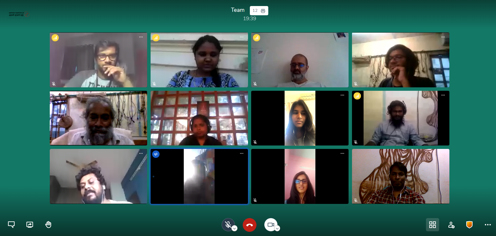

# Welcome

## **Janastu is a people oriented open-source collective working to enable community storytelling by the people, for the people.**&#x20;

Our mission is to build decentralized community owned networks to provision local connectivity in remote areas and to facilitate Internet, technology and crafts literacy.&#x20;

We are developing audio annotation tools for community archiving and to help construct storytelling narratives to help in the inclusion of low-semi literates as first class internet citizens.

If you are looking for our old website[, its here.](https://janastu.org/home/index.html#/about-us)

If you want to [join us](contact/join.md) for a meeting to see what we are working on today,[ start at the Agenda](daily/agenda.md)

## Quick Links


[people](people/)



[projects](projects/)

