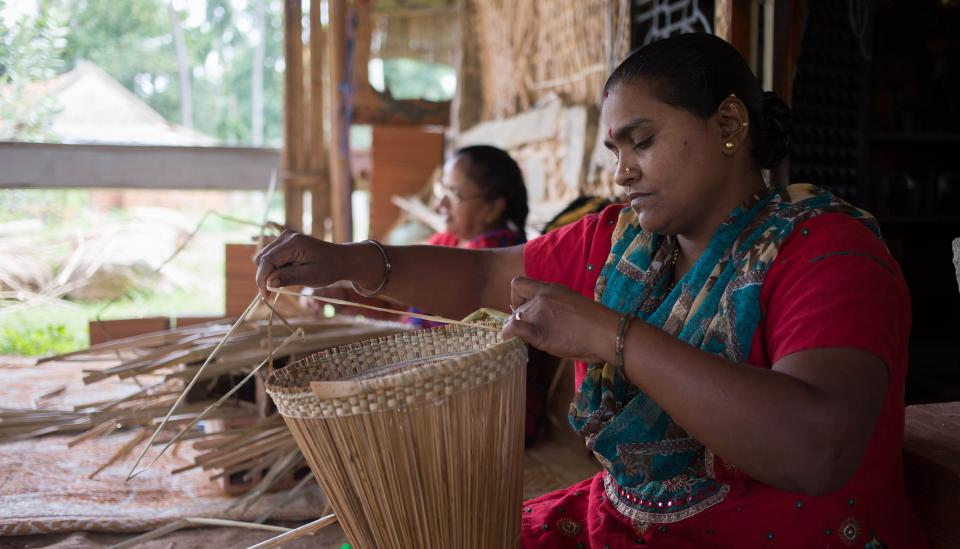
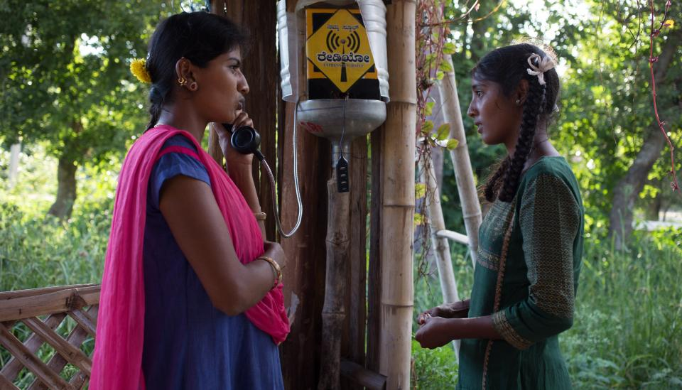

# About

## History&#x20;

Janastu as [**Servelots**](http://www.servelots.com/new/3d.html) began in 1999 when a group of computer scientists came together to provide low-cost and user friendly software solutions to small enterprises. In 2002, Servelots initiated Janastu that provides innovative open source solutions to not-for-profits and communities. Janastu has been granted 12A tax exemption for its work on “Software Commons”.&#x20;

We have worked regionally, nationally and internationally with a wide range of partners: with [Mitan](http://mitan.in/) on renarration of Bio Cultural Protocols and the [Follow Sheep project](http://mitan.in/followsheep/#Home); with the Alternative Law Forum on renarration of the Minimum Wages Act; with Maraa on community radio policy technology application; with [Development Alternatives](https://www.devalt.org/) on community radio audio-tagging and indigenous archives; with [NCBS](https://www.ncbs.res.in/) on the 25 years exhibit of the archives; with IIHS on a media monitoring service; with Gottingen on the [Democracy Archives](https://demx.in/); with Bogazici University on renarration web research; with the Freifunk group on mesh networks; and with Reseau Billital Maroobe of Niger on developing an IVR box for BCP dialog initiation with their shepherding communities.

Since then we have been encouraging the use of mesh for services such as archives and annotations for low-literate community needs for media making, archiving and retrieval using a number of approaches. Servelots organised [AnthillHacks](https://anthillhacks.in/), a gathering of artists, techies, educators, environmentalists, local villagers and students from nearby schools to come together at a hill location and deliberate over a Wi-Fi mesh network and its potential ([anthill.janastu.org](http://anthill.janastu.org/)). With Development Alternatives, we worked on tagging of community radio material by the community so as to help ease navigation of audio content. Hackergram residents and ‘[namdu1 radio](https://www.namdu1radio.com/)’ team developed it further by engaging the community locally.

Our work has revolved around building wifi mesh networks in rural regions and building technological solutions for indigenous communities and nomadic tribes. We have built tools for web re-narration and archiving stories of local communities.&#x20;

**Our current work involves innovating with logical networks to connect devices using cell networks. We are also working on** [**Papad**](http://papad.pantoto.org/)**, a hypermedia annotation tool that can be used in regions with low connectivity and low-literate populations.**

## Philosophy&#x20;

Janastu works on building free and open source technologies for the global south, and builds tools for a truly inclusive web that can address the needs of low-literacy communities that remain unaccounted for in a text-based internet.&#x20;

Tools for a truly inclusive Web need to consider that a large population of the world have low reading literacy, particularly indigenous communities and those experiencing systemic inequity and prejudice. We have built raspberry-pi based tools like mesh networks, radios, webinar devices that can meet the connectivity needs of rural regions in India.

Part of our work has also involved the creation of hypermedia archives and annotation tools that are accessible for low-literacy populations and support oral narratives and audio-visual forms of knowledge. Adapting to the circumstances at present, we are innovating with logical networks in order to connect devices.&#x20;

**Our hope is to build technological infrastructure that is decentralised, inclusive and collective.**

## Services

* One - to - one consulting
* Information management
* Online/offline Knowledge Platforms
* Websites/blogs
* News curation and filtering
* Migrate to Open source
* Localization and Indic language needs
* Location based Applications for policy makers
* Research and Development
