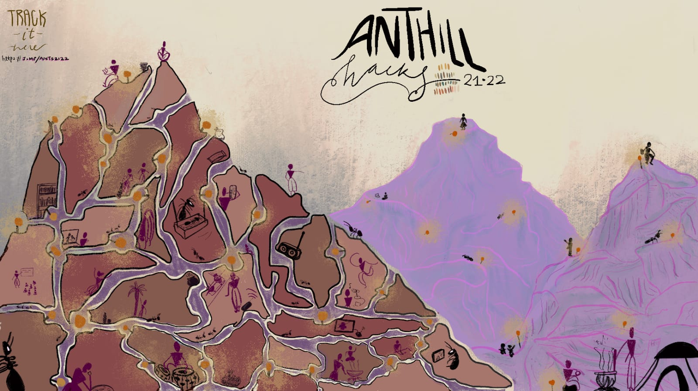

# Anthillhacks 21.22

## **About**

## **T**ogether Being Apart

Our theme is to **Cook together being apart** and **hack together being apart** with in the wifi mesh network area.

Come join us in the beautiful hills near Devarayanadurga, Tumkur where we want to camp, cook and hack together. In the pristine Iruway farm over the course of 10 days, we will be exploring life and sciences in many forms. From learning and practicing sustainable farming practices to learning about building a localised health infrastructure, from Cooking Online and Offline together with our friends and neighbours exploring local recipes to learning about knowledge tools and craft practices from a hyperlocal lens - this is an unparalleled experience spanning from the 24th December 2021 to the 3rd of Jan 2022.

Over the course of AnthillHacks 21.22, we will be exploring different tracks through practice as well as working sessions in collaboration with local participants. These tracks seek to explore a few large questions in small yet meaningful ways

### Dates: Dec 23rd to Jan 4th 

Sessions and activities from **Dec 24th to Jan 3rd** (9 days including the 2 weekends of Dec 24th and Jan 1st)

### Theme: Cook and Hack days 

**Everyday session tracks**

1. Wireless mesh networking, nodes/devices and services
2. Crafts and Maker Space
3. Learning and local content, tools and management
4. Farming, trekking and performances on the rocks
5. Cooking - we want to try if cooking together offline with online participants maybe be a way to connect sideways and informally in these times of fatiguing online sessions.

### Location : near Bangalore, India 

Our wifi mesh network area is about 70km from Bangalore, setup in 4 villages - at the **Devarayanadurga hills** and the valley of Halekote, Durgadahalli and Thimmanayakanahalli. We intend to also connect sessions to our friends outside the mesh area based on nature of activity and interest.

### Volunteer, participate and ideate 

**Please register on this** [**link**](https://nextcloud.livinglabs.network/apps/forms/xk4JEemKJ5M68NYj)**. Registration is free and helps us plan the event.**

Our team is looking forward to include your session or activity request for the days of your participation and preference. Please email us at [anthillhacks@janastu.org](mailto:anthillhacks@janastu.org)

We are looking for documenters and translators for each of the 5 locations in the mesh area.

**Pre-announced parallel cooking sessions** of the same “**recipe**” (adapted to location of the parallelly cooking participants) in different villages of ddhills COWmesh area where some are likely to join in from outside - india and elsewhere. A similar process/pattern we hope will be used for other tech and nontech activities you all bring in to the event.

### Physical Locations within the COWmesh area 

1. Anterras by Yatrinivas, Devarayanadurga/ddhills
2. [Iruway](https://iruway.janastu.org), Halekote
3. [CrafterSpace](https://crafts.janastu.org), Halekote/Durgadahalli
4. Near Village Well, Durgadahalli
5. Tamarind Grove, Thimmanayakanahalli

Distributed sessions, each location will have tents with a large screen, camera and [AsPi devices](https://blog.janastu.org). People can attend sessions live at their location or by choosing a remote channel.

**Setup days** from 20th Dec, 2021 - logistics, food and other requirements.\
**Tech wise** - streaming tools within mesh and for those joining from locations outside.

### Collaborations offered 

[Janastu/Servelots](https://janastu.org) || [Chiguru CoLab](https://chigurucolab.com) || [Gida Living Colors](https://www.instagram.com/gida\_livingcolours/) || [Mudhands](https://mudhands.com) || [Futuretronlabs](https://www.futuretronlabs.in)

### Covid protocols 

While we are open to you coming physically to the locations at ddhills area, we also ask you to be mindful of the need for the physically present to be in comfortable (safe) spaces. We may limit numbers to be 10 in closed spaces and 25 in open spaces. The session owners will be directing who will be in their physical proximity.

### Participation Links for online visitors: 

To get involved in discussions, share your ideas for workshops or sessions, give feedback, and stay in touch with our community, you can join our discord channel.

* Session Link: [https://meet.jit.si/anthillhacks](https://meet.jit.si/anthillhacks)
* Our Discord channel: [http://j.mp/anthillchat](http://j.mp/anthillchat)

### Food & Accommodation: 

There are a couple of rooms in nearby Yatri nivas - a travellers lodge, and other smaller “guest houses” built by the devotees of the temple on the hill in case of larger groups visiting we would like to know a bit earlier to coordinate the logistics. You are welcome to pitch your own tent. We have some tents that can be allotted on a first come basis. One meal a day is planned to be cooked by the participants on a pre-decided recipe, this activity will also be streamed so people online can also be part of the cooking and we are having some local cooks to prepare the other meals.

_**P.S:** Guest house on the hill will be 4km away by 2 wheelers, 12 km by 4 wheelers and 1.5 km by foot from the iruWay farm. Will be closed on 31st and 1st._

### Event Costs: 

Online participation is free. There is a day pass for people coming on-site and a camping pass for those staying overnight (options are guest house on the hill, tents or grass huts at iruway, stay in village house, etc) A sliding scale on both of these passes allows everyone to participate.\
All passes cover breakfast, access to daily talks, workshops, and activities plus costs like equipment rentals, facilities rent, shade structures, electricity, internet and consumables. The camping pass also includes a tent space and the use of shared bathing facilities. Every organizer and participant is a volunteer. We are not for profit but encourage sharing.

| **Pass type** | **Sliding scale** |
| ------------- | ----------------- |
| Day pass      | Rs. 101-1001/day  |
| Camping pass  | Rs. 301-2001/day  |

### Things to Carry: 

* Please bring warm clothes for the evenings.
* Sleeping bags and tents if you have
* Your hacking gear - whatever is your art
* Carry cash, nearest ATM is 6-7 km away


_Ants21.22- Sharable & Editable link to this document:_ [_https://j.mp/ants2122_](https://j.mp/ants2122)__


## OUR HISTORY

\---\
General overview page: [j.mp/myhill](http://j.mp/myhill) and [anthillhacks.in](https://anthillhacks.in)\
A visual overview of the hill after the annotations: [graphical walkthrough](https://anthill.janastu.org/walkthrough.html) "Neowarli" Anthill illustration by Megha Vishwanath\
\---

**ANTHILLHACKS 2015**

* Date: 18-26 July 2015&#x20;
* Location: Anteras, Devarayanadurga hills&#x20;
* Poster: anthillhacks.pantoto.net

**IRUWAY ANTHILLHACKS**

* Date: 13-14 Aug 2016&#x20;
* Location: Devarayanadurga hills&#x20;
* Poster: j.mp/iruway

**SOTM ANTHILLHACKS**&#x20;

* Date: 19-20 Nov 2018
* Location: iruWay farm, foothills of Devarayanadurga hills

**ANTHILLHACKS 2019**

* Date 7-20 Dec 2019&#x20;
* Location Anteras, Devarayanadurga and iruWay farm, Durgadahalli foothill
* [Poster](https://drive.google.com/file/d/1ALnVkESjv2K4tA6Z4tWB7shcPi-l4aR4/view)
* [Video 1](https://vimeo.com/392178753) &  [Video 2](https://vimeo.com/390408799)

**ANTHILLHACKS 20.21** (online sessions)

* Date 30 Dec 2020 -  Jan 27 2021 ****&#x20;
* Session **** information: [https://hackmd.io/6f8fkSXmRui9YgermXXklQ?view](https://hackmd.io/6f8fkSXmRui9YgermXXklQ?view)
* Session link:  [https://classmeet.chiguru.tech/app/anthillhacks](https://classmeet.chiguru.tech/app/anthillhacks/)
* Gathering (pre/post meets): [http://j.mp/wonderant](http://j.mp/wonderant)
* Channel (during sessions): [http://j.mp/anthillchat](http://bit.ly/anthillchat)
* Gitbook (archives/details): [https://open.janastu.org/activity/anthill](https://open.janastu.org/activity/anthill)
* [Poster](https://drive.google.com/file/d/1azzGlwuieHLys1FmhQEthIQT74G1gYlA/view)



* [Anthillhacks Invitation](https://hackmd.io/0QQjiiCoS9WLOwKXjfw5Hg)
* [Anthillhacks references](https://hackmd.io/THg9fxMhRnarWiRxSITj4Q)
* [Anthillhacks 2020 - 2021](https://hackmd.io/xMOBarH7TCyq1hKzWMR0Jg?view)
* [Anthill 2019 email list](https://docs.google.com/document/d/1dlmmpMHxe2QOUtwy8TQKtSBQ2lph2ApTrPult4rzXNE/edit)
* [Speech by Ameen Ahmed - anthillhacks](https://docs.google.com/document/d/1Nd67QG2y-yjT-yj6RP6gV87SHc1uweMB5GSkzAIrzwU/edit)
* [Call for participation AnthillHacks Event 2019](https://docs.google.com/document/d/1b01g49R2ZRbTsHQ6p2JpQv154aZ86DQBWlP2lMBBDKE/edit#heading=h.6agwfv2ievb1)
* [AnnotateThis!](https://docs.google.com/document/d/1ZJqvflU9Biat7n2axYdXE9YMQG0SKnJdn7d4tVriUtg/edit)
* [AnthillHacks2019 Drive link Also our bucket of posters and memes and invites](https://drive.google.com/drive/folders/1ibLrBu5b8RxhA176wNAXvgPW8diFnpNB?usp=sharing)
* [Megha Poster link](https://drive.google.com/drive/folders/1iVQGf10okx0XyC1CUCTA4jdzHAw-KLng?usp=sharing)  poster 2019
* [Invite-pre-event](https://docs.google.com/document/d/19nFoEmDa0SToNqqnDH7BzXmoMDhX\_3myM21Z5MWVuQw/edit?usp=sharing)
* [School program updates](https://docs.google.com/document/d/1rtE9majdZqo-wJrTbtuPDuMVhHs6-uwQzSQsO3vTov0/edit?usp=sharing)
* [Anthillhacks 2019 photos](https://photos.app.goo.gl/ZXd5uxMeEcaYY8rdA)
* [iruway and anthillhacks sotm With students](https://photos.app.goo.gl/1WxQn4gPBG6DZnPG8)
* [Register at anthillhacks.in/register (2019)](https://forms.gle/GrWVcvdRLYNRL62LA)
* [Some media from anthillhacks 2015](https://hackmd.io/THg9fxMhRnarWiRxSITj4Q)
* [AnthillHacks public transportation](https://hackmd.io/e5bpiJzMT-GdsLdl23Tz4Q)
* [Chronicle of AnthillHacks ’19](https://themanikantan.medium.com/anthill-hacks19-87369b19b59c)
* [Chronicles of Anthillhacks 2019 & CNx \~ version 01](https://files.janastu.org/s/ETcjtTzgYr5Qjtw)
* [Spotlight on AnthillHacks by Alekhya](https://vimeo.com/392178753)
* [LibreRouter: the why? by Nicolás Pace](https://vimeo.com/390408799)
* [Anthill 2 min summaries](https://janastu.github.io/maaya/examples/)
* [anthillhacks.pantoto.net](https://anthillhacks.pantoto.net) poster 2015
* &#x20;[j.mp/iruway](http://j.mp/iruway) poster 2016
* [AG and AHH](https://hackmd.io/FFzPF2RZRCSuQMyaRRu9Iw)
* [Anthillhacks20.21 Session](https://files.janastu.org/s/cZprCcGcj4DXRsH)s
* [AnthillHacks2019 drive](https://drive.google.com/drive/folders/1ibLrBu5b8RxhA176wNAXvgPW8diFnpNB?usp=sharing)
* [janastu.gitbook](https://janastu.gitbook.io/anthillhacks/)
* [Test Kumu Map](https://embed.kumu.io/e69c048e410f2ad69e6994e4c27eb64e) and [Data](https://docs.google.com/spreadsheets/d/1eGivGIOd541o-IRvGqM5WQN0P1uEz9K5ajXqAc8v3ds/edit?usp=sharing)&#x20;
* [Anthill-restricted access doc](https://docs.google.com/document/d/1lk5RhtMIBl14KJ\_3vMGXKmxb0MY2gtlCU5zZhl5ilXo/edit?usp=sharing)
* [2019AnthillHacksElectronicItems07to20](https://docs.google.com/spreadsheets/d/1CvJ7xNfW54Rld1Aqz68loMdm6TIMF0ZgxuJ1X-58ROg/edit?usp=sharing)
* Anthillhacks 21.22 Documentation
  * crafts sessions [https://hackmd.io/AMB1NxQcSn-qAzMqf6pHQA](https://hackmd.io/AMB1NxQcSn-qAzMqf6pHQA)
  * [https://pad.riseup.net/p/cow221](https://pad.riseup.net/p/cow221)
  * [https://cryptpad.fr/sheet/#/2/sheet/edit/o7-ZIaXxy0GOkrGh94yGphOr/
    ](https://cryptpad.fr/sheet/#/2/sheet/edit/o7-ZIaXxy0GOkrGh94yGphOr/) Anthillhack calendar





* [https://anthillhacks.in](https://anthillhacks.in)
* [https://anthill.janastu.org/](https://anthill.janastu.org)
* [http://j.mp/ourhills](http://j.mp/ourhills)
* j.mp/myhill



* [https://www.facebook.com/anthillhacks](https://www.facebook.com/anthillhacks)
* [https://twitter.com/anthillhacks](https://twitter.com/anthillhacks)



anthillhacks@janastu.org




