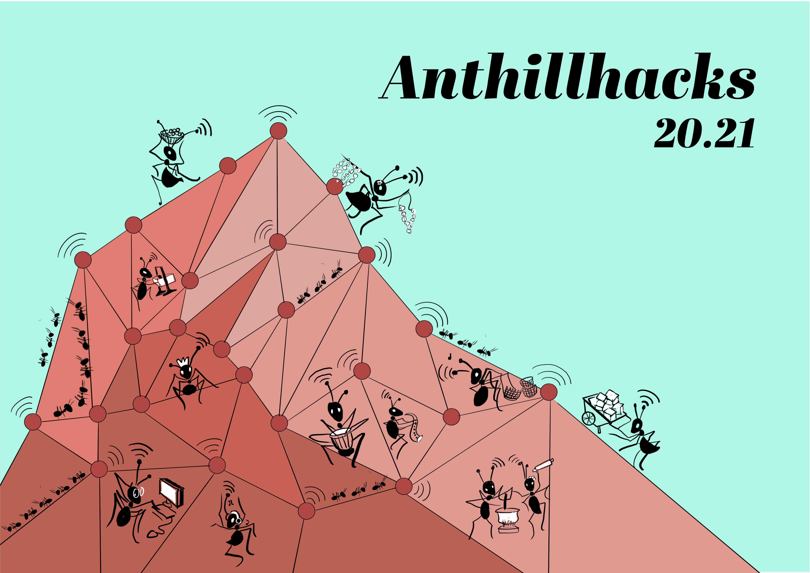
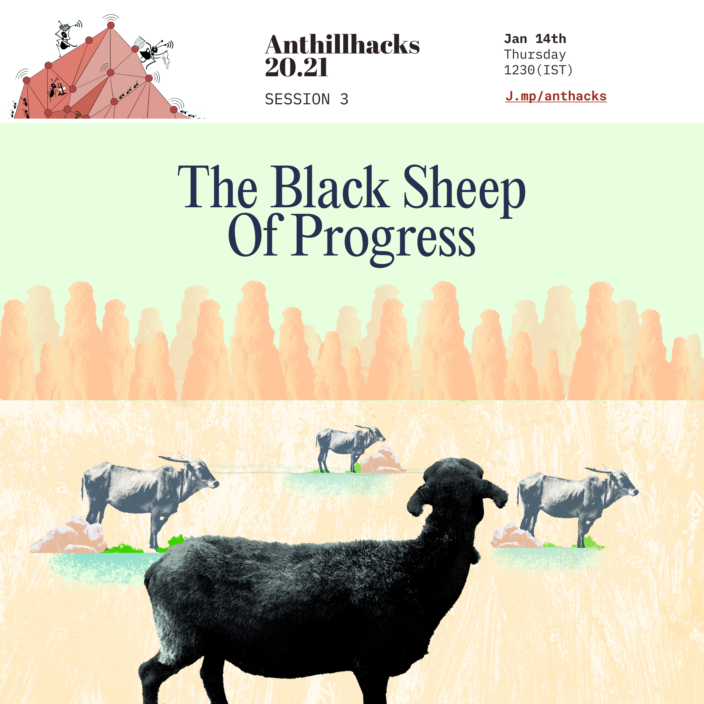

# Anthillhacks 20.21

## **About**



The third major edition of Anthillhacks starts on December 30, 2020 and continues through January 2021 and hopefully longer. This time the idea of Anthillhacks is to encourage people to meet virtually and on site at Iruway Farm near Devarayanadurga and more importantly, in this COVID period, to do small projects, workshops and activities locally wherever participants live. The topics for these breakout, offline sessions will continue the work initiated online. The topics begin with crafts, rural people and the uses of technology. rururbanization and selfhoods, makers spaces, decentralized web and geneaologies of the open source concept.  Our goal for this edition, as for all editions, is to be inclusive of diverse linguistic and literacy groups along with our long ****term commitment to incorporate diversity in other forms in thoughtful and challenging ways. 

* **Session link:** [http://meet.jit.si/anthillhacks](http://meet.jit.si/anthillhacks)

  this link will be where the session will be live. If you are connecting through phone, you can download the Jitsi app and on laptop / desktop you can use latest Chrome or Firefox. [https://jitsi.org/\#download](https://jitsi.org/#download) It is very likely the session will be recorded and also live streamed on Facebook and Youtube. If you do not want be recorded, please message us and we will try to edit you out from the recording.

* **Gathering \(pre/post meets\):** [http://j.mp/wonderant](http://j.mp/wonderant)

  this is a link to a gathering space online, before session and after to meet speakers and others, in private groups or find each other and to continue conversations after the session - maybe with a plate of food \(beyond lunch time in India\).

* **Channel \(during/after sessions\):** [http://j.mp/anthillchat](http://bit.ly/anthillchat)

  this is the discord link/invite for larger conversations around AnthillHacks. Discord is a chatting forum where you can lurk around and initiate conversations. You can give feedback, start new workshops and suggest new directions. There's a channel where we collect the links that attendees have sent in relation to the talks. Another channel holds notes from the session. Feel free to explore, roam and lurk around after-hours.

* **Gitbook \(archives/details\):** [https://open.janastu.org/activity/anthill](https://open.janastu.org/activity/anthill)

## **Earlier**

### **December 30, 2020 12.30 PM Session 1 Craft**

 **Yatharth**, Crafts/Technology/Futures, Designer, Janastu Collective, Bangalore  
 **Atul Johri**, Design-Craft interfaces, Tulsi Farms, Chennapattana  
 **Annapurna Garimella**, Interlocutor, Managing Trustee, A.R.T. Trust, Bangalore  
**** _Session Recording_:  [https://files.janastu.org/s/prxkz7xZqAn3sN4](https://files.janastu.org/s/prxkz7xZqAn3sN4)

### **January 06, 2021 12.30 PM Session 2 Rural People and the Use of Technology**

 **Girish Vedanth**, on community radio, Pragati Foundation, Nonavinakere  
 **Sindhura D. Manjunath**, on videos and villagers, A.R.T. Trust, Bangalore  
 **Indu Krishnan**, Interlocutor, Documentary Film Maker, Bangalore  
**** _Session Recording_:  [https://files.janastu.org/s/2CiazTD4pwCrwdH](https://files.janastu.org/s/2CiazTD4pwCrwdH)

### **January 14, 2021 12.30 PM Session 3** The Black Sheep of Progress

**Shalini** on the pastoral fields near Belgaum with **Neelkantha mama** and **Ankit's film crew** on making of the documentary 'Herd Walk/Bhed Chal'. [http://mitan.in/followsheep/](http://mitan.in/followsheep/)

**Shrestha** with ESG team in the villages by **Amrut Mahal Kava**l near Chellakere with **Karianna** on Farmer Producer Orgs. Readings from ESG archives [https://esgindia.org/new/tag/amrit-mahal-kaval/](https://esgindia.org/new/tag/amrit-mahal-kaval/)

Interlocutor: **Prof. Kandasamy**, **Prof Animal Genetics**, Coimbatore



_Session Recording_: [ https://files.janastu.org/s/Rz8zATmxy7nQCqb](%20https://files.janastu.org/s/Rz8zATmxy7nQCqb)

## **Topics Upcoming**

Rururbanization  
Tinkering and Thinkering   
Wireless Mesh   
Opensource Genealogies

## OUR HISTORY

---  
General overview page: [j.mp/myhill](http://j.mp/myhill)  
A visual overview of the hill after the annotations: [graphical walkthrough](https://anthill.janastu.org/walkthrough.html)  
"Neowarli" Anthill illustration by Megha Vishwanath  
---

**ANTHILLHACKS 2015**

* Date: 18-26 July 2015 
* Location: Anteras, Devarayanadurga hills 
* Poster: anthillhacks.pantoto.net

**IRUWAY ANTHILLHACKS**

* Date: 13-14 Aug 2016 
* Location: Devarayanadurga hills 
* Poster: j.mp/iruway

**SOTM ANTHILLHACKS** 

* Date: 19-20 Nov 2018
* Location: iruWay farm, foothills of Devarayanadurga hills

**ANTHILLHACKS 2019**

* Date 7-20 Dec 2019 
* Location Anteras, Devarayanadurga and iruWay farm, Durgadahalli foothill
* [Poster](https://drive.google.com/file/d/1ALnVkESjv2K4tA6Z4tWB7shcPi-l4aR4/view)
* [Video 1](https://vimeo.com/392178753) &  [Video 2](https://vimeo.com/390408799)

**ANTHILLHACKS 20.21** \(online sessions\)

* Date 30 Dec 2020 -  Jan 27 2021 ****
* Session link:  [https://classmeet.chiguru.tech/app/anthillhacks](https://classmeet.chiguru.tech/app/anthillhacks/)
* Gathering \(pre/post meets\): [http://j.mp/wonderant](http://j.mp/wonderant)
* Channel \(during sessions\): [http://j.mp/anthillchat](http://bit.ly/anthillchat)
* Gitbook \(archives/details\): [https://open.janastu.org/activity/anthill](https://open.janastu.org/activity/anthill)
* [Poster](https://drive.google.com/file/d/1azzGlwuieHLys1FmhQEthIQT74G1gYlA/view)



* [Anthillhacks Invitation](https://hackmd.io/0QQjiiCoS9WLOwKXjfw5Hg)
* [Anthillhacks references](https://hackmd.io/THg9fxMhRnarWiRxSITj4Q)
* [Anthillhacks 2020 - 2021](https://hackmd.io/xMOBarH7TCyq1hKzWMR0Jg?view)
* [Anthill 2019 email list](https://docs.google.com/document/d/1dlmmpMHxe2QOUtwy8TQKtSBQ2lph2ApTrPult4rzXNE/edit)
* [Speech by Ameen Ahmed - anthillhacks](https://docs.google.com/document/d/1Nd67QG2y-yjT-yj6RP6gV87SHc1uweMB5GSkzAIrzwU/edit)
* [Call for participation AnthillHacks Event 2019](https://docs.google.com/document/d/1b01g49R2ZRbTsHQ6p2JpQv154aZ86DQBWlP2lMBBDKE/edit#heading=h.6agwfv2ievb1)
* [AnnotateThis!](https://docs.google.com/document/d/1ZJqvflU9Biat7n2axYdXE9YMQG0SKnJdn7d4tVriUtg/edit)
* [AnthillHacks2019 Drive link Also our bucket of posters and memes and invites](https://drive.google.com/drive/folders/1ibLrBu5b8RxhA176wNAXvgPW8diFnpNB?usp=sharing)
* [Megha Poster link](https://drive.google.com/drive/folders/1iVQGf10okx0XyC1CUCTA4jdzHAw-KLng?usp=sharing)  poster 2019
* [Invite-pre-event](https://docs.google.com/document/d/19nFoEmDa0SToNqqnDH7BzXmoMDhX_3myM21Z5MWVuQw/edit?usp=sharing)
* [School program updates](https://docs.google.com/document/d/1rtE9majdZqo-wJrTbtuPDuMVhHs6-uwQzSQsO3vTov0/edit?usp=sharing)
* [Anthillhacks 2019 photos](https://photos.app.goo.gl/ZXd5uxMeEcaYY8rdA)
* [iruway and anthillhacks sotm With students](https://photos.app.goo.gl/1WxQn4gPBG6DZnPG8)
* [Register at anthillhacks.in/register \(2019\)](https://forms.gle/GrWVcvdRLYNRL62LA)
* [Some media from anthillhacks 2015](https://hackmd.io/THg9fxMhRnarWiRxSITj4Q)
* [AnthillHacks public transportation](https://hackmd.io/e5bpiJzMT-GdsLdl23Tz4Q)
* [Chronicle of AnthillHacks ’19](https://themanikantan.medium.com/anthill-hacks19-87369b19b59c)
* [Chronicles of Anthillhacks 2019 & CNx ~ version 01](https://files.janastu.org/s/ETcjtTzgYr5Qjtw)
* [Spotlight on AnthillHacks by Alekhya](https://vimeo.com/392178753)
* [LibreRouter: the why? by Nicolás Pace](https://vimeo.com/390408799)
* [Anthill 2 min summaries](https://janastu.github.io/maaya/examples/)
* [anthillhacks.pantoto.net](https://anthillhacks.pantoto.net/) poster 2015
*  [j.mp/iruway](http://j.mp/iruway) poster 2016
* [AG and AHH](https://hackmd.io/FFzPF2RZRCSuQMyaRRu9Iw)
* [Anthillhacks20.21 Session](https://files.janastu.org/s/cZprCcGcj4DXRsH)s
* [AnthillHacks2019 drive](https://drive.google.com/drive/folders/1ibLrBu5b8RxhA176wNAXvgPW8diFnpNB?usp=sharing)
* [janastu.gitbook](https://janastu.gitbook.io/anthillhacks/)
* [Test Kumu Map](https://embed.kumu.io/e69c048e410f2ad69e6994e4c27eb64e) and [Data](https://docs.google.com/spreadsheets/d/1eGivGIOd541o-IRvGqM5WQN0P1uEz9K5ajXqAc8v3ds/edit?usp=sharing) 
* [Anthill-restricted access doc](https://docs.google.com/document/d/1lk5RhtMIBl14KJ_3vMGXKmxb0MY2gtlCU5zZhl5ilXo/edit?usp=sharing)
* [2019AnthillHacksElectronicItems07to20](https://docs.google.com/spreadsheets/d/1CvJ7xNfW54Rld1Aqz68loMdm6TIMF0ZgxuJ1X-58ROg/edit?usp=sharing)





* [https://anthillhacks.in](https://anthillhacks.in)
* [https://anthill.janastu.org/](https://anthill.janastu.org/)
* [http://j.mp/ourhills](http://j.mp/ourhills)
* j.mp/myhill



* [https://www.facebook.com/anthillhacks](https://www.facebook.com/anthillhacks)
* [https://twitter.com/anthillhacks](https://twitter.com/anthillhacks)



```text
Email: anthillhacks@janastu.org
```

