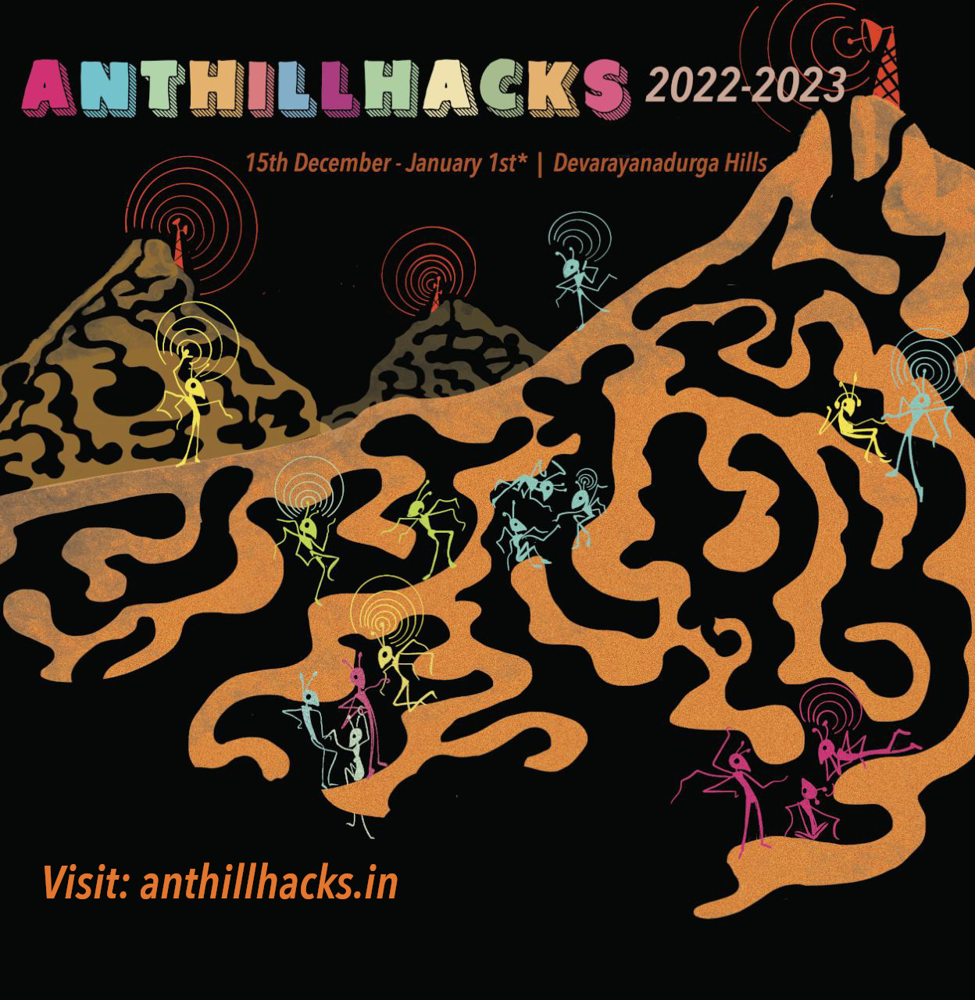

# Anthillhacks Co-Creation


<figure><figcaption></figcaption></figure>

## Planning Anthillhacks 2022 - 2023?

**Anthillhacks 2022 - 2023?**

Starting **Dec 15th** we begin the build activities and invite friends and community to help.

We expect the event activities to start by the weekend after which is the 17th and 18th of December. We expect it to go on until the end of the year and into the new year but most activities to peak before the 24th (Saturday)

STORIES

```
- everyday some stories and films
```

GENDER

```
- everyday on gender and inclusion
```

FOOD

```
- everyday different nodes
```

The event will be distributed in the COWMesh area but the iruWay campus will have the main gathering with accommodation in and around the campus.

We invite organizations to announce days of their convenience and we hope to help build the activities around them.

**build days** - nodes setup with ASPi, mesh extended with additional nodes including test setups - spaces for activities - distributed and CN contexts - COWLanding page setup - people roles and responsibilities. **There are plans to setup multiple LR mesh networks services and dWeb demos.**

**Topics of interest suggested for:**

gender days, libre router (LR) and antennas, community networks and services, cowlanding and applications, voice communications and media archiving, annotations and renarration, dWeb and Community Networks, e-vehicles and rural design, organic and permaculture, internet independence and education, heritage and biodiverity narratives (ethno botanical practices), crafts and arts, data rituals (30% of economy; creating markets by formalising the informal economy), resource mapping exercises, follow the sheep and other map story telling, sustainable structures, open space events, makerspaces, creative community displays, hikes treks and bouldering, .. **creative music and large puppets  (friends of Agnii - Art for All)**

Again at the beautiful **hills near Devarayanadurga, Tumkur** where we want to camp, cook and hack together. In the pristine Iruway farm over the course of 15 days, and we are open to ideas of making this event more distributed.

Be a collaborator! Cocreator and Theme or session developer.

### Location : near Bangalore, India <a href="#location-near-bangalore-india" id="location-near-bangalore-india"></a>

Our wifi mesh network area is about 70km from Bangalore, setup in 4 villages - at the **Devarayanadurga hills** and the valley of Halekote, Durgadahalli and Thimmanayakanahalli. We intend to also connect sessions to our friends outside the mesh area based on nature of activity and interest.

### Volunteer, participate and ideate <a href="#volunteer-participate-and-ideate" id="volunteer-participate-and-ideate"></a>

Our team is looking forward to include your session or activity request for the days of your participation and preference. Please email us at [anthillhacks@janastu.org](mailto:anthillhacks@janastu.org)

We are looking for documentation and translation help for each of the locations in the mesh area.

### Collaborations offered <a href="#collaborations-offered" id="collaborations-offered"></a>

APC and CN networks || [Janastu/Servelots](https://janastu.org/) || [Chiguru CoLab](https://chigurucolab.com/) || [OpenSpace Foundation](https://openspacefoundation.in/)|| [Gida Living Colors](https://www.instagram.com/gida\_livingcolours/) || [`0penstudi0`](http://instagram.com/0penstudi0) || [Marali Mannige](https://www.instagram.com/maralimannige) || [Tex-art Studio](https://www.instagram.com/texart\_studio19) || [`artsy_hudugi`](https://www.instagram.com/artsy\_hudugi) || [Futuretronlabs](https://www.futuretronlabs.in/) || [Design Beku](http://designbeku.in) ||&#x20;

### Food & Accommodation: <a href="#food-amp-accommodation" id="food-amp-accommodation"></a>

There are a few rooms and a number of tents that can be reserved. You are welcome to pitch your own tent. You get to choose when you register. Please bring warm cloths for the evenings. Follow on [anthillhacks.in](https://anthillhacks.in)&#x20;

### Event Costs: <a href="#event-costs" id="event-costs"></a>

We wish that the cost will NOT prevent anyone who wishes to engage. Write to us of your constraints and needs. (more details later)

### Things to Carry: <a href="#things-to-carry" id="things-to-carry"></a>

* Please bring warm clothes for the evenings.
* Sleeping bags and tents if you have
* Your hacking gear - whatever is your art
* Carry some cash, nearest ATM is 6-7 km away


## OUR HISTORY

\---\
General overview page: [j.mp/myhill](http://j.mp/myhill) and [anthillhacks.in](https://anthillhacks.in/) (under construction)\
A visual overview of the hill after the annotations: [graphical walkthrough](https://anthill.janastu.org/walkthrough.html) "Neowarli" Anthill illustration by Megha Vishwanath\
\---

**ANTHILLHACKS 2015**

* Date: 18-26 July 2015
* Location: Anteras, Devarayanadurga hills
* Poster: anthillhacks.pantoto.net

**IRUWAY ANTHILLHACKS**

* Date: 13-14 Aug 2016
* Location: Devarayanadurga hills
* Poster: j.mp/iruway

**SOTM ANTHILLHACKS**

* Date: 19-20 Nov 2018
* Location: iruWay farm, foothills of Devarayanadurga hills

**ANTHILLHACKS 2019**

* Date 7-20 Dec 2019
* Location Anteras, Devarayanadurga and iruWay farm, Durgadahalli foothill
* [Poster](https://drive.google.com/file/d/1ALnVkESjv2K4tA6Z4tWB7shcPi-l4aR4/view)
* [Video 1](https://vimeo.com/392178753) & [Video 2](https://vimeo.com/390408799)

**ANTHILLHACKS 20.21** (online sessions)

* Date 30 Dec 2020 - Jan 27 2021 \*\*\*\*
* Session \*\*\*\* information: [https://hackmd.io/6f8fkSXmRui9YgermXXklQ?view](https://hackmd.io/6f8fkSXmRui9YgermXXklQ?view)
* Session link: [https://classmeet.chiguru.tech/app/anthillhacks](https://classmeet.chiguru.tech/app/anthillhacks/)
* Gathering (pre/post meets): [http://j.mp/wonderant](http://j.mp/wonderant)
* Channel (during sessions): [http://j.mp/anthillchat](http://bit.ly/anthillchat)
* Gitbook (archives/details): [https://open.janastu.org/activity/anthill](https://open.janastu.org/activity/anthill)
* [Poster](https://drive.google.com/file/d/1azzGlwuieHLys1FmhQEthIQT74G1gYlA/view)

ANTHILLHACKS 21.22

* [anthill2122.md](anthill2122.md "mention")



* [Anthillhacks Invitation](https://hackmd.io/0QQjiiCoS9WLOwKXjfw5Hg)
* [Anthillhacks references](https://hackmd.io/THg9fxMhRnarWiRxSITj4Q)
* [Anthillhacks 2020 - 2021](https://hackmd.io/xMOBarH7TCyq1hKzWMR0Jg?view)
* [Anthill 2019 email list](https://docs.google.com/document/d/1dlmmpMHxe2QOUtwy8TQKtSBQ2lph2ApTrPult4rzXNE/edit)
* [Speech by Ameen Ahmed - anthillhacks](https://docs.google.com/document/d/1Nd67QG2y-yjT-yj6RP6gV87SHc1uweMB5GSkzAIrzwU/edit)
* [Call for participation AnthillHacks Event 2019](https://docs.google.com/document/d/1b01g49R2ZRbTsHQ6p2JpQv154aZ86DQBWlP2lMBBDKE/edit#heading=h.6agwfv2ievb1)
* [AnnotateThis!](https://docs.google.com/document/d/1ZJqvflU9Biat7n2axYdXE9YMQG0SKnJdn7d4tVriUtg/edit)
* [AnthillHacks2019 Drive link Also our bucket of posters and memes and invites](https://drive.google.com/drive/folders/1ibLrBu5b8RxhA176wNAXvgPW8diFnpNB?usp=sharing)
* [Megha Poster link](https://drive.google.com/drive/folders/1iVQGf10okx0XyC1CUCTA4jdzHAw-KLng?usp=sharing) poster 2019
* [Invite-pre-event](https://docs.google.com/document/d/19nFoEmDa0SToNqqnDH7BzXmoMDhX\_3myM21Z5MWVuQw/edit?usp=sharing)
* [School program updates](https://docs.google.com/document/d/1rtE9majdZqo-wJrTbtuPDuMVhHs6-uwQzSQsO3vTov0/edit?usp=sharing)
* [Anthillhacks 2019 photos](https://photos.app.goo.gl/ZXd5uxMeEcaYY8rdA)
* [iruway and anthillhacks sotm With students](https://photos.app.goo.gl/1WxQn4gPBG6DZnPG8)
* [Register at anthillhacks.in/register (2019)](https://forms.gle/GrWVcvdRLYNRL62LA)
* [Some media from anthillhacks 2015](https://hackmd.io/THg9fxMhRnarWiRxSITj4Q)
* [AnthillHacks public transportation](https://hackmd.io/e5bpiJzMT-GdsLdl23Tz4Q)
* [Chronicle of AnthillHacks ’19](https://themanikantan.medium.com/anthill-hacks19-87369b19b59c)
* [Chronicles of Anthillhacks 2019 & CNx \~ version 01](https://files.janastu.org/s/ETcjtTzgYr5Qjtw)
* [Spotlight on AnthillHacks by Alekhya](https://vimeo.com/392178753)
* [LibreRouter: the why? by Nicolás Pace](https://vimeo.com/390408799)
* [Anthill 2 min summaries](https://janastu.github.io/maaya/examples/)
* [anthillhacks.pantoto.net](https://anthillhacks.pantoto.net/) poster 2015
* [j.mp/iruway](http://j.mp/iruway) poster 2016
* [AG and AHH](https://hackmd.io/FFzPF2RZRCSuQMyaRRu9Iw)
* [Anthillhacks20.21 Session](https://files.janastu.org/s/cZprCcGcj4DXRsH)s
* [AnthillHacks2019 drive](https://drive.google.com/drive/folders/1ibLrBu5b8RxhA176wNAXvgPW8diFnpNB?usp=sharing)
* [janastu.gitbook](https://janastu.gitbook.io/anthillhacks/)
* [Test Kumu Map](https://embed.kumu.io/e69c048e410f2ad69e6994e4c27eb64e) and [Data](https://docs.google.com/spreadsheets/d/1eGivGIOd541o-IRvGqM5WQN0P1uEz9K5ajXqAc8v3ds/edit?usp=sharing)
* [Anthill-restricted access doc](https://docs.google.com/document/d/1lk5RhtMIBl14KJ\_3vMGXKmxb0MY2gtlCU5zZhl5ilXo/edit?usp=sharing)
* [2019AnthillHacksElectronicItems07to20](https://docs.google.com/spreadsheets/d/1CvJ7xNfW54Rld1Aqz68loMdm6TIMF0ZgxuJ1X-58ROg/edit?usp=sharing)
* Anthillhacks 21.22 Documentation
  * crafts sessions [https://hackmd.io/AMB1NxQcSn-qAzMqf6pHQA](https://hackmd.io/AMB1NxQcSn-qAzMqf6pHQA)
  * [https://pad.riseup.net/p/cow221](https://pad.riseup.net/p/cow221)
  * [https://cryptpad.fr/sheet/#/2/sheet/edit/o7-ZIaXxy0GOkrGh94yGphOr/ ](https://cryptpad.fr/sheet/#/2/sheet/edit/o7-ZIaXxy0GOkrGh94yGphOr/)Anthillhack calendar





* [https://anthillhacks.in](https://anthillhacks.in)
* [https://anthill.janastu.org/](https://anthill.janastu.org/)
* [http://j.mp/ourhills](http://j.mp/ourhills)
* [https://j.mp/myhill](https://j.mp/myhill)



* [https://www.facebook.com/anthillhacks](https://www.facebook.com/anthillhacks)
* [https://twitter.com/anthillhacks](https://twitter.com/anthillhacks)



anthillhacks@janastu.org


