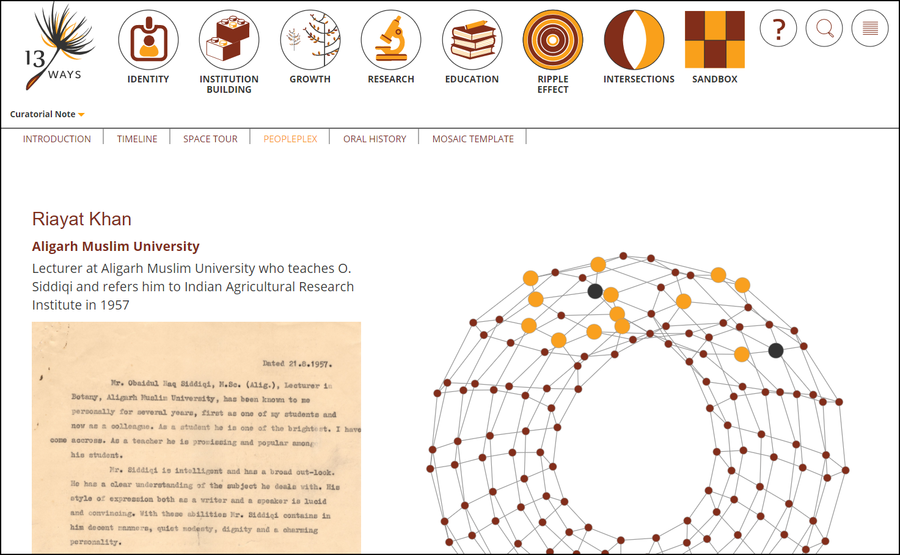

# 13ways

13 Ways is a "Storytelling from Archives" of NCBS conceived by Venkat Srinivasan for its 25th anniversary.

"Built around multiple ways to reflect upon and assemble the history of the institution, the exhibit brings to light a tangled history and unlikely journey, weaved by over 70 story tellers, over 600 photographs, official records, letters, and the occasional lab note. Where does meaning reside in an archival document? And how can we better engage with archival repositories to form stories? The exhibit is an attempt to answer these questions through the history of an institution. It is the first phase of a digital experiment in archiving, journalism and storytelling."



