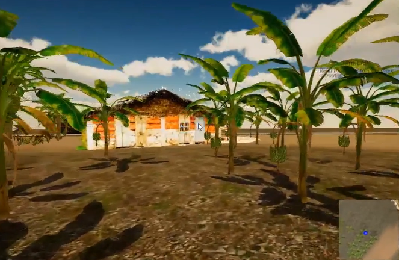

# 3D Project

3D reconstruction, spatial navigation and gamification, virtual reality and augmented reality. How can a web visitor to be able to walk into an office and start interacting with the objects? How can we provision 3D desktops with interactive objects? What would be a simple process and an optimal technology to capture and virtually deploy real spaces augmented with synthetic objects? How do we handle closed spaces like offices and open spaces like a village or a town? What are the most appropriate technologies for a web based toolset? Our Virtual Library explored walking into a library, pickingup a book and flipping through the pages using a Web browser. [(](http://library100.janastu.org/)[library100.janastu.or](http://library100.janastu.org/)g work is a tribute to 100 years of our state Central Library at Cubbon park, Bangalore). This work was accompanied by 3D reconstruction of rural spaces and gamifying the exploration of these spaces for learning activities and introducing them to visitors offline and online.

**3D Scanning, Reconstruction for Immersive experience**

* Faro Scanner for scanning Monuments and Physical space.
* 3D Mapping
* [3D reconstruction for gaming and education purposes.](http://anthill.janastu.org)
* [Photo realistic and immersive experience on web](https://itb.janastu.org/)

## Gameplay and Demo videos

* FarmCraft: Unity Engine Mode
  * Game: [http://ac\_pages.pantoto.net/Farmcraft/](http://ac\_pages.pantoto.net/Farmcraft/)



* FarmCraft: Walk-through with Story Narrative - video annotation



* FarmCraft: Reconstruction and Audio annotation



* FarmCraft: Character Interaction



* Virtual Library (ESG Library - find a book - the process)



* State Library



* Virtual Reality Story of Devarayana Durga Hills



* Map indoor spaces



## &#x20;Overview of links to the projects

* **1>** **ITB**&#x20;
  * [http://itb.janastu.org/ ](http://itb.janastu.org/) 360 views of Traveller’s Bungalow, Devarayana Durga
* **2> State Central Library Centennary**
  * 360 views of Central Library, Cubbon Park [http://library100.janastu.org/ ](http://library100.janastu.org/)

> **3> VLIB: Interactive libraries. Explore real libraries through 360 panoramas.  Access id: admin 3354** &#x20;

* **3a>** **State Library demo**&#x20;
  * [http://pantoto.net/2014-2016/project/demo/ ](http://pantoto.net/2014-2016/project/demo/)Choose from 2 different 3d books. Click first opened book to flip through it.
* **3b>** **Esg Library demo**
  * [http://pantoto.net/2014-2016/project/esg-2/](http://pantoto.net/2014-2016/project/esg-2/) Navigate around library by right click and drag,
  * [http://pantoto.net/2014-2016/project/esg\_library/ ](http://pantoto.net/2014-2016/project/esg\_library/) This version contains 3d layout of the library.
* **3c>** **Interactive physics panoramas**
  * 3d balls ‘interact’ with 2d panoramas. Click anywhere to make balls. Notice how they react with walls, bed, tables. [http://pantoto.net/2014-2016/project/hall\_pano\_interactive\_physics/ ](http://pantoto.net/2014-2016/project/hall\_pano\_interactive\_physics/)
* **3d> Book on table**
  * [http://pantoto.net/2014-2016/project/lib15/ ](http://pantoto.net/2014-2016/project/lib15/) Book casts a shadow on the table.
* **3e> Myra library**
  * [http://pantoto.net/2014-2016/project/myra\_pano/ ](http://pantoto.net/2014-2016/project/myra\_pano/)4 views of the library. View 2 is hdr.
* **3f> Office panorama**
  * [http://pantoto.net/2014-2016/project/office\_pano/ ](http://pantoto.net/2014-2016/project/office\_pano/)structure sensor model overlapping panorama.
* **3h> Photogrammetry, 3d reconstruction**
  * [http://pantoto.net/2014-2016/project/photogrammetry/18.html ](http://pantoto.net/2014-2016/project/photogrammetry/18.html) 3d of a room. Allow time to load. Use wsad to walk around, mouse to look around.
* **3i> Scan2cad , panorama overlap**
  * [http://pantoto.net/2014-2016/project/testcases\_post\_june2016/vlib-experiments-hallpano-scan2cad/vlib-experiments-hall\_pano/panoramaWithModel.html ](http://pantoto.net/2014-2016/project/testcases\_post\_june2016/vlib-experiments-hallpano-scan2cad/vlib-experiments-hall\_pano/panoramaWithModel.html)
  * [http://pantoto.net/2014-2016/project/testcases\_post\_june2016/vlib-experiments-scan2cad-ricoh/](http://pantoto.net/2014-2016/project/testcases\_post\_june2016/vlib-experiments-scan2cad-ricoh/) An interesting cross examination.
* **3j> Canvas output**
  * Structure sensor + canvas app paid conversion[ http://pantoto.net/2014-2016/project/testcases\_post\_june2016/vlib-experiments-hallpano-scan2cad/vlib-experiments-hall\_pano/convertedAndScaled.html ](http://pantoto.net/2014-2016/project/testcases\_post\_june2016/vlib-experiments-hallpano-scan2cad/vlib-experiments-hall\_pano/convertedAndScaled.html)
* **4> Anthill walkthrough**
  * A 3d view of the village of devarayana durga with SWeeTs, 360 panoramas, 3d reconstructed models.[ http://anthill.janastu.org/walkthrough.html](http://anthill.janastu.org/walkthrough.html)



* FarmCraft Game
  * [http://ac\_pages.pantoto.net/Farmcraft/](http://ac\_pages.pantoto.net/Farmcraft/)
* [3D Walks Work 2019](https://docs.google.com/document/d/1nu8vF6ZdgD-kdkf61eest6bL3mSqF7D\_-gyWGkbAMS4/edit)
* [3D/Design/Videos Walks Works 2020](https://docs.google.com/document/d/1mkxA4yJ6bhbi-lTK5CWqkJyP3kva0V8QcSdzr0QFEko/edit)
* [Video narratives](https://docs.google.com/document/d/1RdFiUvzTaP5coQ3JvaNrcdLJypEwy94uN-\_3uGqXv2Y/edit)
* [Open Research Brief](https://hackmd.io/c454YbJyQGSQ13BobDR\_RA)
* [Demo with random hesarghatta panorama](https://hubs.mozilla.com/9ojfiR9/pure-linen-volume)
* [Discord Integration](https://discord.gg/VmS2p6)
* [Spoke Demo](https://hubs.mozilla.com/scenes/En2BTqu)
* [Hub demo with customized scene objects](https://hub.link/vRCCNq7) and this another [link](https://hubs.mozilla.com/9ojfiR9/pure-linen-volume)
* [Pano stories from pratiksha on ITB using getfader](https://app.getfader.com/projects/64a1c57f-3824-4cc0-8088-ccf510db976f/publish)
* [For interactive panorama](https://bear71vr.nfb.ca/)
* [UNityServelots-Anthony](https://drive.google.com/drive/folders/1vIfdbWdDzZgl8nqgNgmS9Iml0L3hS-rb?usp=sharing)
* [VR story of DD hills](https://app.getfader.com/projects/64a1c57f-3824-4cc0-8088-ccf510db976f/publish)


