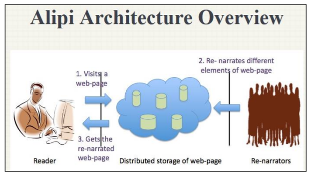

# Alipi

**"**[**Alipi**](https://www.janastu.org/home/index.html#/alipi)**" means people without-alphabet or those who are text/print-impaired, ie., non-literates and low-literates.** Alipi, the Re-narration Web is set of tools for developing and rendering narratives that assist in accessing Web-content across cultural boundaries and in familiar scenarios of communitities with diversity in literacy. Re-narration Web is therefore about Web-accessibility for all \(literate inclusive\). [http://wiki.janastu.org/Alipi details some history of this work.](http://www.janastu.org/technoscience/index.php/Alipi) 

The idea of the Re-narration Web is to provide a person visiting a Web page, a comfortable narrative of the page content based on the visitor profile and contributions of alternative narratives made available by the community who engages with it. Imagine, an illiterate grandma gets a link on her Android phone and an HTML5 rendition of the page will play a video of the page with audio narration she can understand. See http://a11y.in Designing for Inclusion” is the slogan that captures theworld-wide effort to make the web a valuable resource for all seven billion humans, ”whatever of their abilities, age, eco-nomic situation, education, geographic location, languageetc.” \(WAI\). 



The issue of accessibility and inclusion has been a concern in the design of the web and will continue to remain so for a long time. In the early days of the web, for those on the other side of the digital divide, one of the issues was of physical access to the capable device but now we have "smartphones". Among the challenges is making content delivered to such devices truly accessible.

* Community radios and inclusion, nbu, cowmesh and gender







* The below video shows how re-narration helps a community to understand the policies or laws of a government.







* [Accessibility for the Print-impaired \(ALipi\)](https://application.isif.asia/theme/default/files/ISIFGrants2010-TechnicalReport_Servelots.pdf)
* [https://wiki.janastu.org/wiki/Category:Alipi](https://wiki.janastu.org/wiki/Category:Alipi)
* [http://servelots.com/isif/final/Alipi\_guidelines\_2011July04.pdf](http://servelots.com/isif/final/Alipi_guidelines_2011July04.pdf)
* [Alipi presentation pdf](http://www.lt-innovate.org/sites/default/files/attachments/2.Servelots-TB%20Dinesh.pdf)
* [alipi - god's own content](https://hasjob.co/servelots.com/cimg7)
* [what is accessibility? presentation pdf](https://fdocuments.in/document/httpa11yin-web-accessibility-for-inclusion-dineshservelotscom-web-accessibility.html)
* [Alipi demo - amara](https://amara.org/en/videos/ARQE072JP7cD/info/alipi-demo/)



