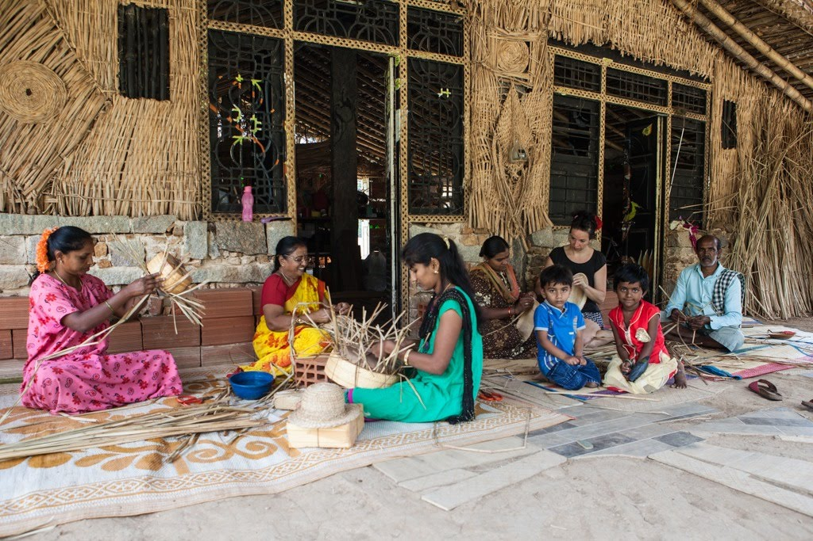

# CrafterSpace



In a Craft Cluster, nearby craft centers are assisted by a central makerspace which serves as a tool making, design and communications skilling for the local women and youth.&#x20;

The CrafterSpace, our first center, engages in research and technology development to make sustainable connections between local people, locally available materials and tools, and the required techniques and technology. A community knowledge archive, community radio and digital storytelling activities are also part of the space. It encourages renewal of craft skills so women and youth in rural areas are able to collaboratively handle design communication, end-to-end orders, production, distribution, marketing and supply chain management. It aspires to augment area economies with craft, tech and media capacities in addition to enhancing local cultural economic spaces. CrafterSpace is based in the foothills of Devarayanadurga at Halekote of Durgadahalli is collaboratively developed by Mitan and Janastu, and funded by Rotary Dist. 3190 through a Rotary International Global Grant. The center intends to bring an ideology of craftsmanship that can be applied in a positive, real-world way by aspiring craftspersons and convey a user-oriented understanding of contemporary technologies that can make craft livelihoods more productive and better able to find markets. It has been a research and resource center for creative crafts and product prototyping using locally and naturally available material such as Bull Rush grass, Areca leaves, Coconuts produce, banana fibre, sheep wool, etc.

&#x20;Se[e](http://crafts.janastu.org) [crafts.janastu.o](http://crafts.janastu.org)rg



* [Dec 9th photo at servelots - food packaging boxes and etc with etching](https://photos.app.goo.gl/dWQG15NHFppzUy3y9)
* [Dec 13th Saju wine/vinegar tasting](https://photos.app.goo.gl/KuRhkxZvov9Ucjs47)
* [Dec 16th Mela with freeman team at Thimnayakanahalli](https://photos.app.goo.gl/KuRhkxZvov9Ucjs47) (large set)
* [Dec 16th Thimnayakanahalli mela](https://photos.app.goo.gl/b3M1LFtcYXrpqkie6) (small set)
* [Dec 20 - 21 pics of Aravind wedding](https://photos.app.goo.gl/5DGctSteNncgpygSA)
* [Dec 26th Adarsh Engagement gifts](https://photos.app.goo.gl/TLg5hTFwtVG3ezGx5)
* [Jan 1 - areca leaf raw material - tumkur garden](https://photos.app.goo.gl/oP8dvU2wHGPGaMhCA)
* [Jan 13th Thimnayakanahalli mela](https://photos.app.goo.gl/oWmdWdzTv4HEnxoi9)
* [Jan 15th Sankranthi Bagana at tumkur](https://photos.app.goo.gl/ztd1Zu8pzQqsnsLYA)
* [Jan 18-20 Stall at State Millet Fair](https://photos.app.goo.gl/DvFQZsfNn7uvKfq27)
* [Jan 26th Prasanna at Crafterspace / madya nisheda walk tumkur](https://photos.app.goo.gl/6smwyGfBXPFAX3Z39)
* [Feb 10-11 pics of crafterspace by chandra (shesh frnd)](https://photos.app.goo.gl/YS3D8Fc9AehSnJtQ6)
* [Feb 15ish Medals for kere habba. Moda and Mahua/Ippe](https://photos.app.goo.gl/YHrRRhWx3CoH6sGA9)
* [Feb 20 Babita and all from Unbox visit the farm](https://photos.app.goo.gl/18WSqJaDD8euESk19)
* [Feb 21 Sira Group working with Handicapped for training](https://photos.app.goo.gl/7jKbPphgg2gmPVot9)
* [Feb 24 Sunday with electric unicycle, basket with liner, hillhacks visitors, Namadachilume multi activity - radio, eub, crafts, drumming by Raja](https://photos.app.goo.gl/GPtrZSGUkSQhLSpY8)
* ****[Namada Chilume multi activity introduction](https://photos.app.goo.gl/KfFrGBEsasnmjJ6y6)
* [CrafterSpace: Photo Blog](https://hackmd.io/zKShHbI3Ry2XiuMF5NhRtg)
* [Wine bottle packaging](https://hackmd.io/wDfq5J\_\_RJqWrvKxeRnQHA)
* [Blog Points](https://hackmd.io/05wGsCQ3SqOu50Y0l\_jSQA)
* [Kaniaya Community UP Migrants @ Kothanur, South Bangalore](https://hackmd.io/xk6BXVcuTu6ssT7v4gt3TQ)
* [Blog: CrafterSpace](https://docs.google.com/document/d/15K8Go5P5yJEepcB2v-hUF4XY9NMP1CfWg1O68K6JvFg/edit?usp=sharing)
* [CNC Router Workflow](https://docs.google.com/document/d/1v7fa8nLCEcK52QwS2Ahp8hUXZrMQN7wDbdqph3-pepw/edit)
* [Crafter Space Workshop](https://docs.google.com/document/d/1\_1ChMDQPOnc\_vfL0WgJ0OLd5zdeH\_m4vvPHMxhVYQ08/edit)
* [RI final slides](https://docs.google.com/presentation/d/1FSS3xBE8DUWxUYHFMnDgcyiDXVtrDCCDEQlxo9Lin9k/edit#slide=id.p)
* [CrafterSpace Photos 2019 - 2020](https://photos.app.goo.gl/rxMGJJvqAypQnrzX8)
* [Some equipment photos](https://photos.app.goo.gl/G2BnCtMAaCSVoXQq6)
* [Jan 2019 - Millet Mela stall and all.](https://photos.app.goo.gl/J7zDRyDg16jNADSr5)
* ****[busy craft center (malleshwaram women group)](https://photos.app.goo.gl/NzCW9Z3mKv5wHAB97)
* [fashion show prakash bidapa](https://photos.app.goo.gl/bJXz5qz8jvsq8iZL6)
* [Tumkur workshop latha lalitha retirement event](https://photos.app.goo.gl/SW73oTr9CEUVR4Lf9)
* [ckp dastakaar workshop](https://photos.app.goo.gl/cnitzezC5q6yrffW7)
* [ganesh fest baagina production and decoration](https://photos.app.goo.gl/2GL2fGt38NMm69aVA)
* [general craft products and images](https://photos.app.goo.gl/EjoLxbFRrtpQ5F3o7)
* [kehaan bluematchbox workshop](https://photos.app.goo.gl/1uKtSpq46QDhAGri8)
* [craft made elsewhere some images](https://photos.app.goo.gl/dVuReYe93QSgvdETA)
* [aravind engagement fruits in baskets and ornamental gifts](https://photos.app.goo.gl/5ZF9nCRT3k7G49RH7)
* [craft center opening jan 2018](https://photos.app.goo.gl/qjRYAz5mzbea5qReA)
* [craft center before the opening](https://photos.app.goo.gl/Qu2xQVkXCAvRw1Hf9) bhoomi and paula pics
*   [early craft center pics, products, workshop and durgadahalli hills view](https://photos.app.goo.gl/hUaxXS595Tu1cmpZ8) (can start video with

    hills view and coming to craft center)
* [early craft experiments and durgadahalli images](https://photos.app.goo.gl/PQQWv5XLZxrdmPtu6)
* [Sunday Mela in Durgada Halli](https://photos.app.goo.gl/sSENA684A8JLK6Ep8)
* [laura pics Nov 2018](https://drive.google.com/drive/u/3/folders/14pXeQlZNcuht4uHisNqpyHew9Ztk4II8)
* [Thimnayakanahalli Mela Jan 2019](https://photos.app.goo.gl/LoRd2JiBhjntmCMm8)
* [Adarsh engagement gift bags and boxes](https://photos.app.goo.gl/reZUftJb5hCJg7H6A)
* [CrafterSpace Albums](https://docs.google.com/document/d/1CO8\_RI\_vP7GSG-Qcmxdu7KGWvfON6afbt3qhWqaUu4Y/edit#heading=h.xlwvgvz1p7ok)
* [Catalogue Crafter Space](https://drive.google.com/drive/folders/10sOCdPijqspZ9zDAwUZ2\_A3cinZPFfHo?usp=sharing)





* [https://crafts.janastu.org/](https://crafts.janastu.org)
* [https://www.instagram.com/crafter\_space/](https://www.instagram.com/crafter\_space/)


