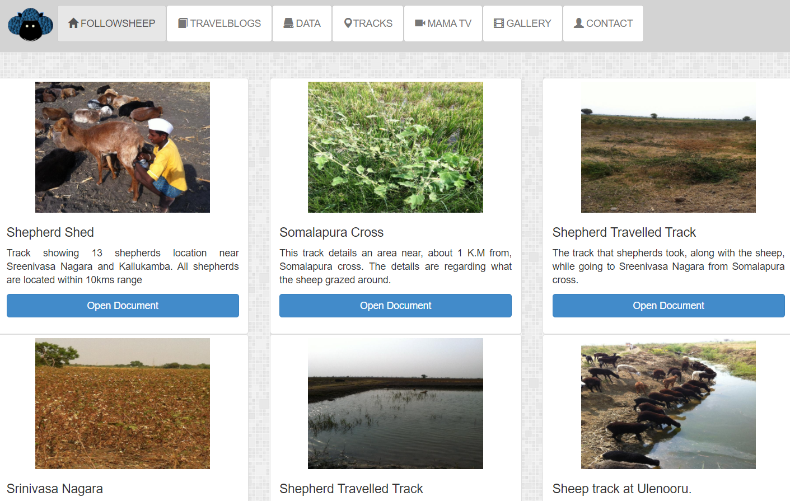

# Follow the Sheep

Follow the Sheep project involves following shepherds and their (mostly black) sheep, in the Deccan areas of Karnataka and Andra Pradesh of India. Shepherds are low-literate in general and the nomadic shepherds travel about 400 kms over a range of 6 to 8 months with their herds. They are in small groups of 3-8 family members. Every few days they migrate to another location that can help feed their sheep. When in a location, they are often in a farmer’s land after having negotiated feed for sheep in return of sheep manure (night droppings). During the day they can graze part of the farm (as per negotiation) and take the sheep to other grazing areas which are often common property reserves (CPRs), and to areas where there is a water body.

This work comprises of BaaApp app (janastu.org/apps/baaapp) which allows to track, record waypoints interactively on the map with photo, text-note or voice recordings. Then can then be uploaded to a common server where they can be studied by researchers/NGOs who can help negotiate for CPR and nomadic mobility rights including BCP formulation and land range observations. IIIT Hyderabad Socionity project has also used it to study app utilisation and to help develop complimentary applications. We use OSM data and OSMtracker app to configure/develop this app and related services.















* [https://github.com/janastu/followsheep-tracker-server](https://github.com/janastu/followsheep-tracker-server)
* [https://www.youtube.com/user/pradeephdc/videos](https://www.youtube.com/user/pradeephdc/videos)


