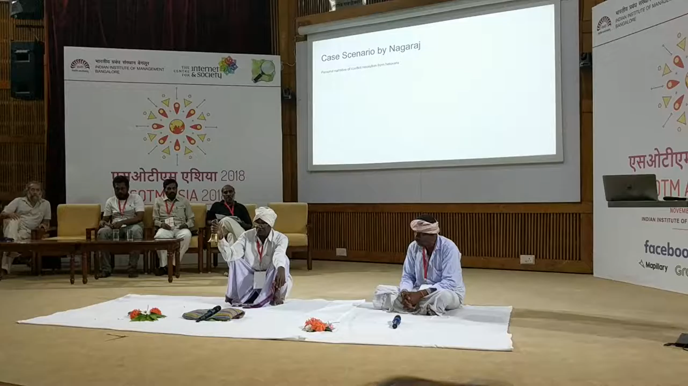

# Helavaru

Tradition of recording genealogy with story-teling.



* [Bhed Chal. Week around Belgaum with Shepherds](https://photos.app.goo.gl/Wt6xTWbfMRtaJ2976)
* [Wayfinding through Storytelling; Communities in Karnataka, India - TB Dinesh and Helavaru](https://youtu.be/IxPjnVX9mKg)
* [Day 1: Wayfinding through Storytelling; Communities in Karnataka, India - TB Dinesh and Helavaru](https://youtu.be/Pm_D9JW0xWU)



