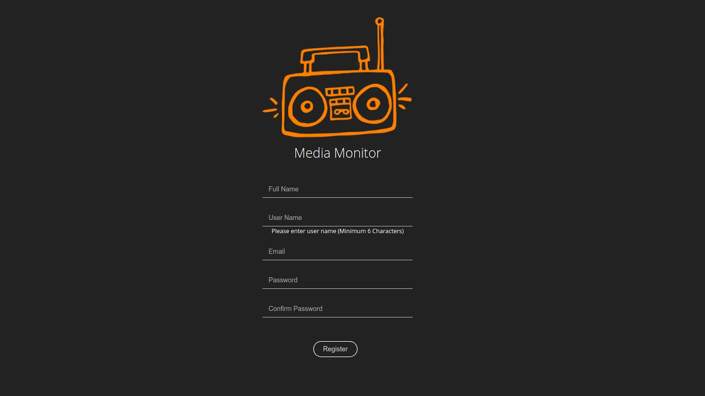

# IIHS Media Monitor

Media Monitoring is a necessary activity for all research organisations. Newsrack.in is a flexible news aggregator and news categoriser based on user defined concepts and user indicated news srouces \(RSS feeds\). Media Monitoring application is an adapation of Newsrack for institute wide archival, communications and research needs. A Curation Board pull new feeds and monitoring team can curate the feeds to send out the days interesting media to their group while also archiving them on institutions server.

Note, as newsrack needs to be revamped, this media monitoring has be rendered disfunctional! Newsrack was developed over 10 years ago by Subbu as an open source and free service and its now looking for a rebuild.

**IIHS Dashboard**

The Curation Board is an application to pull new feeds and curate the feeds to send out the Media Monitor. The application allows a user to add feeds from various news sources in the rss format to the user dashboard.

Features:

* Curator who is a admin will be allowed to create and manage groups and users.
* All the registered users will be part of a default group.
* The Curator can Bookmark a feed to read later.
* The Curator can Delete the feed from his board.The curator can also delete the board itself.
* Feeds are filtered based on date,feeds can be sorted according to latest and oldest feeds.
* Feeds can be organised in four different views like \(Article,Card,Magazine,title\)
* The Curator can create a board and add feeds to the board.And can send out the board with its feeds as Media Monitor.



1. [Initial IIHS dashboard report prepared by Bhanu](https://docs.google.com/document/d/1HlHxmm-tahm2Ycrz5aqBhOhyHgGhERJTEygUknFAA64/edit?usp=sharing)
2. [Weekly report IIHS dashboard](https://docs.google.com/document/d/1at6co3-ZcnhnmUUmiD0PC4DTW1T_ReTOlMOzJ2a6zcQ/edit?usp=sharing)
3. [Minutes of meeting report on 22-03-2018](https://docs.google.com/document/d/1W5ZLSrVdryTWlhl0z2ERIIRLMFe1bmDdOriW2kreBvo/edit?usp=sharing)
4. [Minutes of meeting report on 29-09-2018](https://docs.google.com/document/d/1LQeA5o6_NRtuQr2rpxNINX12nZUxq8Exmdgm3LaZOgs/edit?usp=sharing)
5. [Code directory Structure](https://docs.google.com/document/d/11nYIgiYJGCWOslq6p23f1xaAZPP95fJ2PGPNowQJI8E/edit?usp=sharing)
6. [IIHS Dashboard User Manual](https://docs.google.com/document/d/1voJSit29bWGguNexnp1AJtv0zs9GTCveS467mqIlKJg/edit?usp=sharing)
7. [Data Structures and Couchdb Views for IIHS](https://docs.google.com/document/d/1e1_6UXnYc1uS5K30eOdohUKORt2cyeWHt_dD4y9yyF8/edit?usp=sharing) 
8. [Feedparser Service flow and Architecture](https://docs.google.com/document/d/1l7ZXhCFUd4Y1J8ykUokMnGk644tiwjM0YnNuHE3BqgU/edit?usp=sharing)
9. [Resources and Link referred for both IIHS and PhoMo](https://docs.google.com/document/d/1R3HcMjQcfP2Rf8MnS-mON-Kwho6jIq5V47sy_i5uA7A/edit?usp=sharing)
10. [Detailed Developer Project Report](https://docs.google.com/document/d/1R4k-_P2ZGYx53vgxlXMg2-CaKtGj4QPlFyRZ3l1EhpQ/edit?usp=sharing)
11. [iihs mm closing phase 2 - mom 7 sep](https://docs.google.com/document/d/1uHfKwRgEL0xeI7PUrJuY1-inVWCDj7WFDzP96UOQ9yY/edit?usp=sharing)



1. [Dashboard -Client - Angular 4 framework](https://github.com/janastu/iihs_curation_dashboard)
2. [Authentication Service - Superlogin - Node Js and Couchdb](https://github.com/janastu/iihs_curation_auth)
3. [Feedparser Service - Node Js](https://github.com/janastu/iihs_curation_feedparser)



