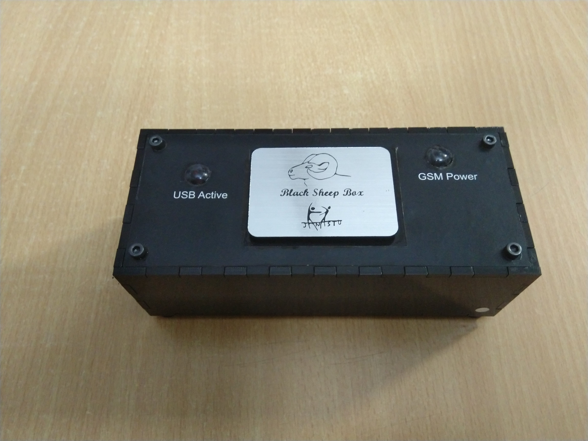

# IVR Box

IVR \(interactive voice response\) box is a Raspberry Pi based shoe box that can be carried around or shipped to a certain region. It can enable calling and receiving calls based on SIM cards inserted. IVR questions can be configured and responses collated. This box was built for Reseau Billital Maroobe of Niger for BCP dialog initiation with their shepherding communities.



1. [ Report on Device Required for IVR Project with description](https://docs.google.com/document/d/1HudMhMxhvZBsAJc8F1CH8Vc-ADVQ7xuPzOarfpo62VQ/edit)
2. [ Report on Developer manual to develop IVR Menu with Voice Blue Next device configurations](https://docs.google.com/document/d/1xGzVPgbdT8BoRKHoBkfWZNusyK925Piiyo51ytuXaFY/edit)
3. [Report on User Manual for testing IVR Menu and changing the audio files](https://docs.google.com/document/d/1xGzVPgbdT8BoRKHoBkfWZNusyK925Piiyo51ytuXaFY/edit)
4. [Github link for Extension.conf file to configure extensions in Asterisk](https://github.com/janastu/regiN/blob/master/extensions.conf)
5. [Github link for SIP.conf file to configure sip in asterisk](https://github.com/janastu/regiN/blob/master/extensions.conf)
6. [Report on Test Case for Testing  IVR Menu created for Servelots and Janastu Organization of 3 Levels](https://docs.google.com/document/d/1apZdQE7X3l3vox5hQWK0tXS1m21Ze7pw77YEIoQiIUY/edit)
7. [Blacksheep box by Sanketh](https://photos.app.goo.gl/QSvPMGrAmPXsfWfB8)
8. [IVR Develpoper Documentaiton](https://docs.google.com/document/d/1nyRiBRECTWZFFdL2QpW6gMdrcmFJMGtSa3xdktO36ig/edit?usp=sharing)
9. [Technical support to Bio-cultural community protocol first Phase Documentation](https://docs.google.com/document/d/1OgQ4X_Njrf8vGiajfU-SJ8mzVsvgoRew3epv3yEyHJw/edit?usp=sharing)
10. [response-to-saverio-email-april-18](https://docs.google.com/document/d/1N6x8JLDkSNPznlS58KnVwn6aQTUyKwFUJa1R2BTr76Y/edit?usp=sharing)
11. [IVR\_data](https://drive.google.com/drive/folders/1HhFADWkh0BwfM2ap6G3DGZfjXBJ2Xksu?usp=sharing)



