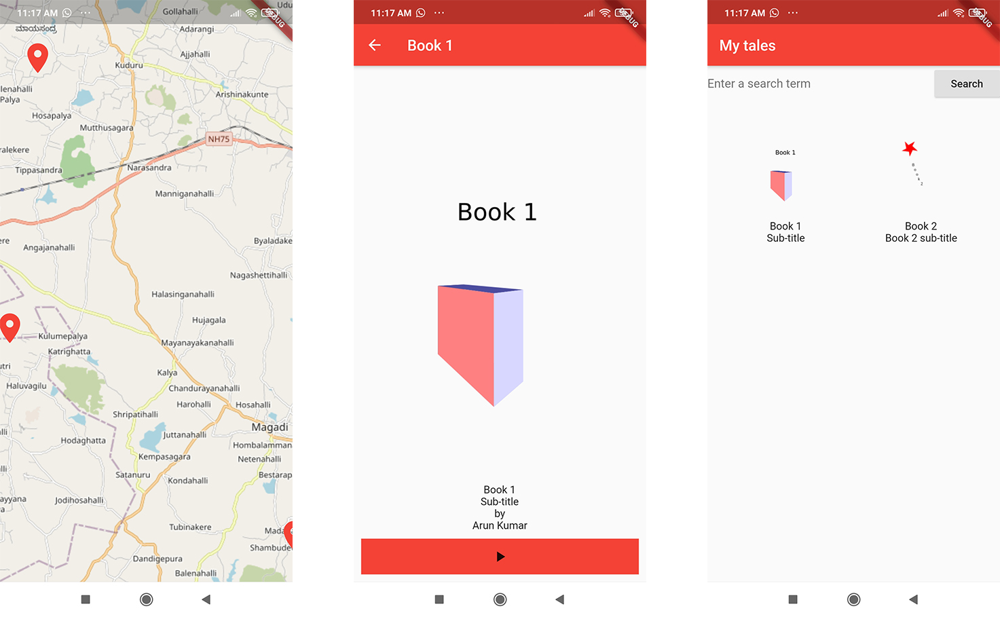

# Maptales

This is a software design document that captures the system requirements and discusses the overall architecture of the system. The system in question is one designed for creating, publishing and consuming locative media. Locative media is media, text, audio, video, that has been geo-located. There are multiple types of locative media currently available, such as the KML files coming from the ‘Follow the sheep’ project.

The idea is to allow this media to be consumed in a player application which allows the viewing of media at particular geo-locations. This can be used to create interactive narratives and other forms of non-linear narratives that involves the user of the media moving through physical space to consume media.

Examples of narratives could be treasure hunts where users have to unlock clues at different locations that take them to other locations to find treasure. Interactive fiction where users move from point A to B to navigate the fiction, to take the story forward. Guided city tours are another possibility, where users are shown different media at different locations and they get to know or understand media taken or about a particular location.



* [Working Title: MapTales](https://docs.google.com/document/d/1RY2o2Zr6ZH6mBG2P7Hx-8JersDG7NGHq_dnSA3Dac0g/edit?usp=sharing)
* [https://github.com/janastu/maptales\_player](https://github.com/janastu/maptales_player)



