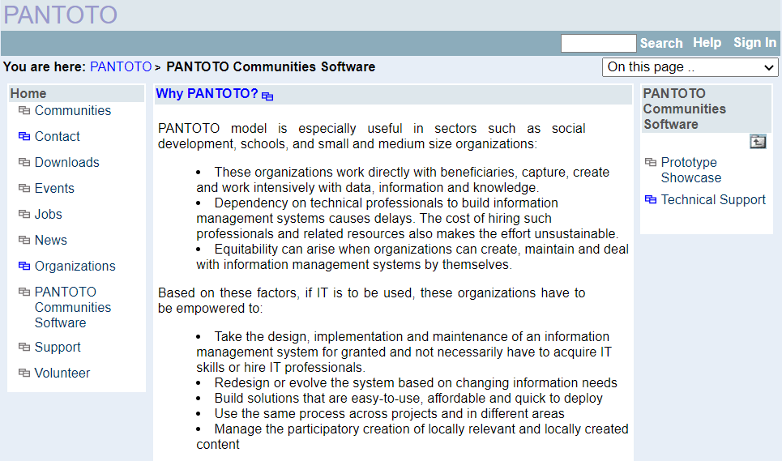

# Pantoto

Pantoto Communities is a Web-based software for Communities to Manage Community Knowledge. Pantoto Communities server has been used over 10 years by a number of NGOs for their managing their community knowledge. Pantoto Communities platform is about 20 years old and has gone through many iterations of development. Pantoto Mouchak, which began 10 years ago, is the version of Pantoto Communities which is a Javascript framework that uses SWeeTs to extend its functionality. Pantoto Communities work is now transforming itself into loosly coupled set of tools that are Web Annotation based. [pantoto.janastu.org](http://pantoto.janastu.org/)







* [Developing Community Mobility Applications](https://www.w3.org/2006/07/MWI-EC/Presentation/dinesh-mobile-w3c.pdf)
* [Online Pantoto Communities](http://www.pantoto.org/)



