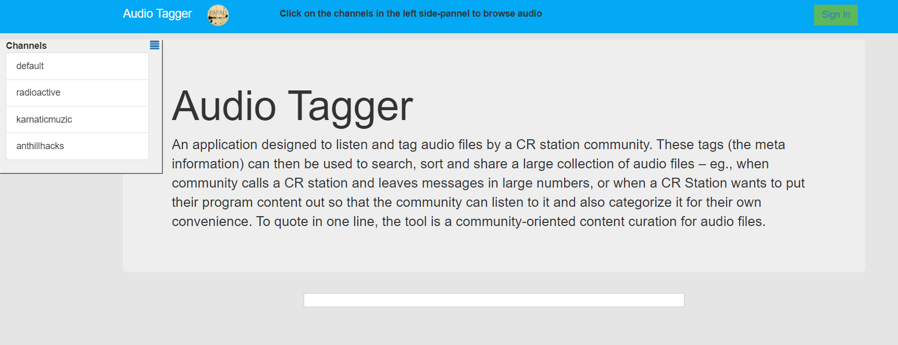

# Papad API

## **Summary**

We have been telling stories, re-telling stories and weaving incredibly complex network of stories. How can Internet standards, protocols and tools support this basic human need? How can a hyper-media Web of inter-linked stories become discoverable and navigable content for all - inclusive of low-literate people. How can Internet technologies help archive, reshape, reinterpret, and reinvent to assist the natural ways of storytelling and help capture oral histories and local knowledge directly by the people for the first time in human evolution?

We are working on Papad, a hypermedia annotation tool that can be used across devices and in regions with low internet connectivity and low-literate populations. Tools like papad have significant potential in creating and disseminating knowledge that is audio/video-based, and therefore accessible to populations with lower literacy levels. It can assist anyone in voicing their views on their community related topics. It would be a way to preserve and revive the knowledge for next geneartion. As a tool to share, learn and explore from other communities’ perspectives on art, culture, education, technology, tradition for health and farming.

Our research focus has been on web accessibility for Indian needs in the local context of culture, literacy, and socio-economic conditions. One can upload an audio recording to a local server, browse, listen to audio and tag the entire audio or relevant parts (fragments), annotate a image tag, which can later be used in making audio visual stories that is relevant for the communities. Papad aims to be the audio visual publishing platform for the low literates, without barriers of knowing to read and write.



* [Papad Annotating Audio](https://hackmd.io/IUuNlaICRpy4IoDgYFcGgQ?view)
* [One Papaday at a time](https://hackmd.io/2NsMkpJNTB6uHgW51ctOoQ)
* [cowde-visual](https://salus-sage.github.io/cowde-visual/)



* [Papad Login Page Documentation](https://hackmd.io/1GQqVej\_SX-G0EE\_SeG45w?view)
* [Re-factoring Papad angular front-end application](https://hackmd.io/0l6iS6taRgqFd3MvIcJ\_sw?view)
* [Papad Mobile Requirements](https://hackmd.io/G5DS3pBZTEmLgpFnRvS2DQ)
* [Papad - UX Project](https://docs.google.com/document/d/17P2ZbGmokS2TwLRZ-LaPAobuxKug7w893GuRYygzpNY/edit)



* [Papad Doc - Pre-Draft](https://docs.google.com/document/d/1HMSkFLkHVC82WryG-LgbkH8ViWIT65RN08eQwB4mLjg/edit)
* [Papad Documentation](https://docs.google.com/document/d/1AZzOU\_iEVBKfQSETWQV81NbdDOJjcJ0IMu301d8SkQw/edit)
* [Papad audio annotations data](https://docs.google.com/spreadsheets/d/1aHN2NAQLKTQnlrDUnn7Ri6VkOR-RnDtNbALNfEqeB1k/edit#gid=0)
* [Papad related scrap](https://hackmd.io/rzJihgL4Qk-9wJJfNmRvOg)
* [Papad: An autoethnographic platform for Cultural Mapping](https://docs.google.com/document/d/1ScTL9lTWWXDaQd17OWerQWPefHJLIjC5D70twWO8rGU/edit?usp=sharing)



* [http://papad.pantoto.org/](http://papad.pantoto.org)
*  [http://papad.test.openrun.net](http://papad.test.openrun.net) User: janastu / Pwd: jan123



* [http://papad.test.openrun.net/](http://papad.test.openrun.net) User: janastu / Pwd: jan123
* [https://papad-api-2.test.openrun.net/fragments/](https://papad-api-2.test.openrun.net/fragments/)
* [https://papad.test.openrun.net/item/604b7927c2db367f593eee3a](https://papad.test.openrun.net/item/604b7927c2db367f593eee3a)
* [https://papad.test.openrun.net/item/60536dd8884df2c2883eee55 ](https://papad.test.openrun.net/item/60536dd8884df2c2883eee55)
* [https://papad.test.openrun.net/item/604f7312884df2c2883eee44](https://papad.test.openrun.net/item/604f7312884df2c2883eee44)
* [https://github.com/janastu/papad-api](https://github.com/janastu/papad-api)
* [https://github.com/janastu/papad-monitor](https://github.com/janastu/papad-monitor)


