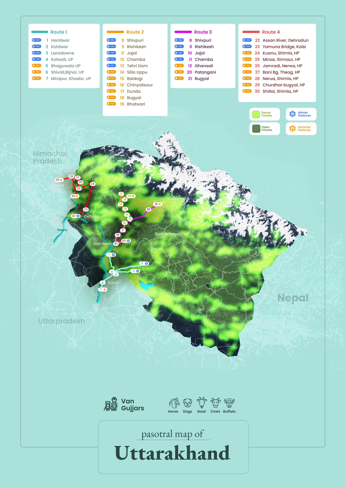

# Pastoral Map

To map routes \(for LL\) - for the Covid study, as well as for the Atlas on Indian pastoralism.



* **Pastrolism**
  * [Mapping data](https://drive.google.com/file/d/1T1RlTckj9Kt9a6ihAkg5ut2Mc9gNYpo1/view?usp=sharing) Pastoralist Doc from Centre for Pastoralism
  * [Pastrol Migratory Routes TamilNadu](https://docs.google.com/spreadsheets/d/1GKJTNZLXlr9_UOn8iAWFRGU8sMO6r0k_U0n-ksydEgk/edit?usp=sharing) - spreadsheet
  * [pastrol-migrate-route-tamilnadu - ](https://thiya-velu.github.io/pastrol-migrate-route-tamilnadu/)url
  * [pastrol-tamilnadu-route - ](https://github.com/Thiya-velu/pastrol-migrate-route-tamilnadu)github code
  * [Pastoralists for Uttarkhand - Google My Maps](https://www.google.com/maps/d/viewer?mid=136j_Q1OqpvaJz9yrPRdzW8dyiUd8Xnlp&ll=30.16178965092533%2C77.98689203598423&z=8)
  * [Pastrol Migrate Route Uttarkhand](https://docs.google.com/spreadsheets/d/1K1eTI0A1iNUyiGqOh7yLmdKzOlv2FdBRMvj7lSeJCe0/edit#gid=0) - Spreadsheet
  * [pastoralists-migrate-route-uttarkhand](https://github.com/Thiya-velu/pastoralists-migrate-route-uttarkhand) -  github code
  * [pastoralists-migrate-route-uttarkhand](https://thiya-velu.github.io/pastoralists-migrate-route-uttarkhand/) - url
  * [Deccan sheep migration from gopi](https://drive.google.com/open?id=1bGK-CrphAPkQ756eZU3i_p7ZIHW0tmwb&usp=sharing_eil) \(This one mostly north KA and border\)
  * [Pastoral Migratory Routes Gujarat](https://docs.google.com/spreadsheets/d/1GmHZ-2KumkFIuSOaySOYYVTnZFoxcbSYbuopDW-aiEw/edit?usp=sharing)
  * [Pastoralists routing map doc](https://docs.google.com/document/d/1VeZYJFpxFjyWoMPZSX4C5We4OpspoXr3DrahGjpp8os/edit?usp=sharing)
  * Bakkarwal git repo: [https://github.com/Thiya-velu/pastoral-migrate-route-jk-bakkarwal](https://github.com/Thiya-velu/pastoral-migrate-route-jk-bakkarwal)
    * live URL: [https://thiya-velu.github.io/pastoral-migrate-route-jk-bakkarwal/](https://thiya-velu.github.io/pastoral-migrate-route-jk-bakkarwal/)
  * Gujjar git Repo: [https://github.com/Thiya-velu/pastoralists-migrate-route-jk-gujjar](https://github.com/Thiya-velu/pastoralists-migrate-route-jk-gujjar)
    * live URL: [https://thiya-velu.github.io/pastoralists-migrate-route-jk-gujjar/](https://thiya-velu.github.io/pastoralists-migrate-route-jk-gujjar/)
  * [Pastrol Migrate Route Jammu and Kashmir](https://docs.google.com/spreadsheets/d/1qG8pVK5xPdUsXR4HT3Sby-L4xyLSQvyd4ACe2V0eZvk/edit?usp=sharing)
  * [Outdoors - mapbox by shafali](https://api.mapbox.com/styles/v1/shafalij/ckoiujstd0s8q17ohswaayrgs.html?fresh=true&title=view&access_token=pk.eyJ1Ijoic2hhZmFsaWoiLCJhIjoiY2tvaTl3Z2JxMDJkMTMxcHZtaDdpOTdqaiJ9.dLXE_k9JZJ7v1tSdngL27Q)
  * [Outdoors - mapbox by micah](https://api.mapbox.com/styles/v1/micahalex/ckojyq8bs01gq17pbfo0hqx28.html?fresh=true&title=view&access_token=pk.eyJ1IjoibWljYWhhbGV4IiwiYSI6ImNrODIwamhpcDB0OHQzbHJ1emV6aGZobmYifQ._Fdp3wH9v-oYzg2ZujLJxw)
  * [pastoralists-routing-map-Doc](https://docs.google.com/document/d/1VeZYJFpxFjyWoMPZSX4C5We4OpspoXr3DrahGjpp8os/edit)
  * [Pasotral map of Uttarakhand Map - Draft design of the Map](https://www.figma.com/file/pVRXds7lanfbBuIGoUi09Q/Untitled?node-id=1%3A2)
    * [Pasotral map of Uttarakhand Map - design jpg](https://drive.google.com/file/d/1GuSQfL4Gzh_o6SYdde0PNLys375k4fZY/view?usp=sharing)
    * [Pasotral map of Uttarakhand Map - design pdf](https://drive.google.com/file/d/1xQq0n0GfzkFmmTOPKXWK_pZDu48MguE_/view?usp=sharing)
  * [Mapping work\_Covid study\_May 19th, 2021](https://docs.google.com/spreadsheets/d/15UeSRJ6MfwyJE-ujmljx-q1nvYlo39uQpj5snTyQ-Gc/edit?usp=sharing)
  * [All Tracks Merged - Deccan Shepherd Migratory routes](https://www.google.com/maps/d/viewer?hl=en&mid=1bGK-CrphAPkQ756eZU3i_p7ZIHW0tmwb&ll=14.464461323271015%2C77.73854850000002&z=8)
  * [Timesheet of Pastoral Mapping\(hrs\)](https://hackmd.io/@miximon/CFP_mapping_estimates/edit)
  * [Pastoral timesheet ](https://docs.google.com/document/d/176AFaKUfmBMwuremm4us4iSDmaJbhuv4foL26PqQkYE/edit?usp=sharing)
  * [gopi on South indian pastoral migration patterns](https://docs.google.com/document/d/1Xbq6RnMcQfRkHXcl3Ivjs_3-eaqfeRYYIHr9HHIozhQ/edit?usp=sharing)
  * [Maharastra Mapping](https://docs.google.com/spreadsheets/d/13_ommkB6IcBzQWvJzFb-Po6PcVgiaorVaG1pNp4wuS8/edit?usp=sharing)
  * [Andhra Pradesh Mapping](https://docs.google.com/spreadsheets/d/1evP6aLYXvqLjqX6l4iQfpFKC-M4bAcXazAtW-t-T83A/edit?usp=sharing)
  * [Migratory paths 2](https://api.mapbox.com/styles/v1/micahalex/ckp8biymy0ezx17sft8zvqcz4.html?fresh=true&title=view&access_token=pk.eyJ1IjoibWljYWhhbGV4IiwiYSI6ImNrODIwamhpcDB0OHQzbHJ1emV6aGZobmYifQ._Fdp3wH9v-oYzg2ZujLJxw) \(New map because the old one ran out\) by Micah
  * [CfP Mapping design](https://www.figma.com/file/pVRXds7lanfbBuIGoUi09Q/CfP-Mapping?node-id=0%3A1)
  * [Pasotral Delivery](https://drive.google.com/drive/folders/1wj2p2Ld62VGy31AncOG1da5yv0z1OwR0?usp=sharing)
  * [Maps Janastu feedback](https://docs.google.com/document/d/1owO8AYlPpToisGuvQ5BHVEs3SB5IjiBD_JY8lnH7KtU/edit?usp=sharing)



* [https://nominatim.openstreetmap.org/ ](https://nominatim.openstreetmap.org/%20)



