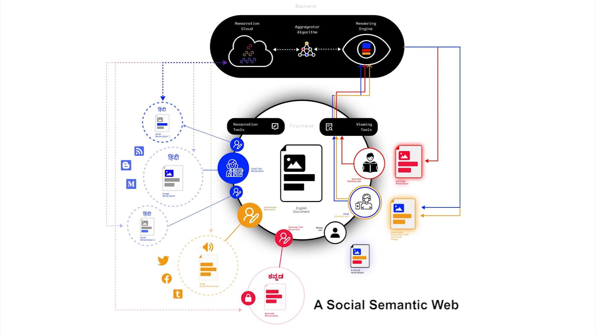
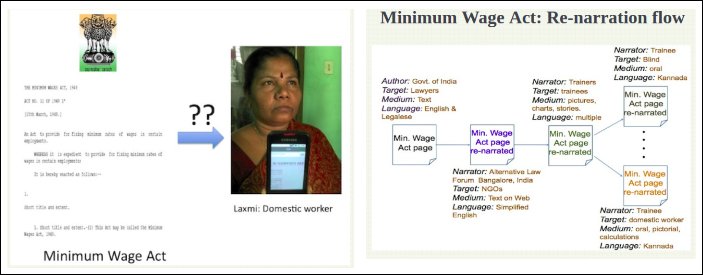

# Renarration Web

We have worked regionally, nationally and internationally with a wide range of partners: with Mitan on renarration of Bio Cultural Protocols and the Follow Sheep project; with the Alternative Law Forum on renarration of the Minimum Wages Act; with Maraa on community radio policy technology application; with Development Alternatives on community radio audio-tagging and indigenous archives.

As low-literates are now becoming the new Internet users, we need to be able to connect to the traditional practices - which have evolved to address in terms of accessibility - so as to foresee the needs of the emerging internet users with a large diversity in literacy and culture. We looked at the web accessibility guidelines, and all of them expect you to be similarly educated–even if you are blind. If you have eyes but cannot read, there is no web accessibility standard that can be used as a guide. Then the focus on localization \(translation\), but accessibility needs to go beyond that.

For us, accessibility means something different. It means a social semantic web. So if it’s a text-heavy document, how do you make it accessible to people who can’t read? We call this \_Renarration \(Sweet Web\), where a SWeeT is a semantci web "tweet". That’s how we started this work – can I take a text document from your blog, take it to my village and make it a visual story for them? What are the actions that I need to take? What do I highlight? So we work with the Web annotation framework. Annotations are another layer over the web. We don’t assume anything is automatic in this process. But this doesn’t take a lot of time. it doesn’t need to be an all or nothing task - typically, it’s more likely that someone provides an alternative narrative that is suitable for the person they want to share the document with.

A presentation of how Web Annotations can support a renarration Web for low-literates ****[http://bit.ly/AnnoReno ](http://bit.ly/AnnoReno%20)

A presentation that contextualizes the opportunity of oral narratives as heritage today -- in contrast to the heritage until today which likely was commissioned by the privileged [http://bit.ly/dinesh-srishti-jan18](http://bit.ly/dinesh-srishti-jan18)

A journal paper titled: Renarration for All [https://arxiv.org/abs/1810.12379](https://arxiv.org/abs/1810.12379)

The coming of the Social Semantic Web thanks to Web Annotations [https://www.w3.org/annotation/wiki/Use\_Cases/Social\_Semantic\_web](https://www.w3.org/annotation/wiki/Use_Cases/Social_Semantic_web)

Early thoughts on Web for people without script. [http://a11y.in](http://a11y.in) and notes from 2011 on renarration: [http://bit.ly/hc0Iep](http://bit.ly/hc0Iep)

Minimum Wages Act - a use case for Renarration. [wiki.janastu.org &gt; minimum wages act](http://wiki.janastu.org/wiki/Category:Alipi) 



Video narratives of minimum wages act at: [https://vimeo.com/273679555](https://vimeo.com/273679555)

Bio-cultural protocols - a use case of Renarration with demo that collates linked-data and builds dynamically an alternative narrative. Is also a demo of how a bio-cultural protocol of Raika - the camel herders - can be renarrated by and for different \(herder\) communities. [http://mitan.in/bcp/raika](http://mitan.in/bcp/raika)

Untold States of Accessibility : [Enumeration of Low-literacy and Diversity in India](https://hackmd.io/QPubwniMTk6brmgSAIT3-g)

[https://wiki.janastu.org/wiki/DiMA](https://wiki.janastu.org/wiki/DiMA) - bring dev/techies in addition to community use case efforts.

Renarration and Accessiblity - T B Dinesh on Localized Knowledge in Rural India By Karissa McKelvey on June 22, 2020 [https://www.digital-democracy.org/blog/renarration-and-accessibility-with-t-b-dinesh/](https://www.digital-democracy.org/blog/renarration-and-accessibility-with-t-b-dinesh/)

**A number of demos that consider diverse scenarios of use have been encouraging:**

* [https://a11y.in/](https://a11y.in/) a visual walk of renarration process and user oriented content recommendations,
* Social semantic web \(local/decentralized\) and bcp [http://mitan.in/bcp/raika/](http://mitan.in/bcp/raika/)
* [https://wiki.janastu.org/wiki/Alipi](https://wiki.janastu.org/wiki/Alipi) Early applications of Renaration ideas
* [https://open.janastu.org/projects/renarration](https://open.janastu.org/projects/renarration) a comprehensive peek at related activities,
* [https://arxiv.org/pdf/1810.12379.pdf](https://arxiv.org/pdf/1810.12379.pdf) Renarration for All journal paper, and ****[https://www.youtube.com/watch?v=svmru\_8Xo9o](https://www.youtube.com/watch?v=svmru_8Xo9o) a video overview from 2016



* [Anno projects re-organisation around Indigo](https://hackmd.io/ShJjpCloR1KUwoGRxD6DXw)
* [timeliner audio api](https://hackmd.io/WxVLAG1sQxS9YSNZ4-fs_g?view)
* [Annotated Re-Narrations updating-memories-v3](https://docs.google.com/presentation/d/1XAVLkGar0GCkzyUuiHOZCFIeksoTv5sbYBV7FiepzUg/edit#slide=id.p3)
* [AnnoTasks](https://docs.google.com/document/d/1jVaVx4rphUnTnFuERDscTLO6_rFbv78tBbaXzP8Yx0Y/edit#heading=h.6x9uhwxy5986)
* [Working doc - What happens to a dream deferred?](https://hackmd.io/ZuH7TdeOTyePp7q9KDPsJA)
* [Towards RMPL](https://hackmd.io/0UKUZwGEQGCDW0IU4-oflw)
* [Annotated Re-Narrations](https://docs.google.com/presentation/d/1XAVLkGar0GCkzyUuiHOZCFIeksoTv5sbYBV7FiepzUg/edit?usp=sharing)
* [https://arxiv.org/pdf/1810.12379.pdf](https://arxiv.org/pdf/1810.12379.pdf)
* [Janastu-sanchaya](http://janastu-sanchaya.blogspot.com/)



